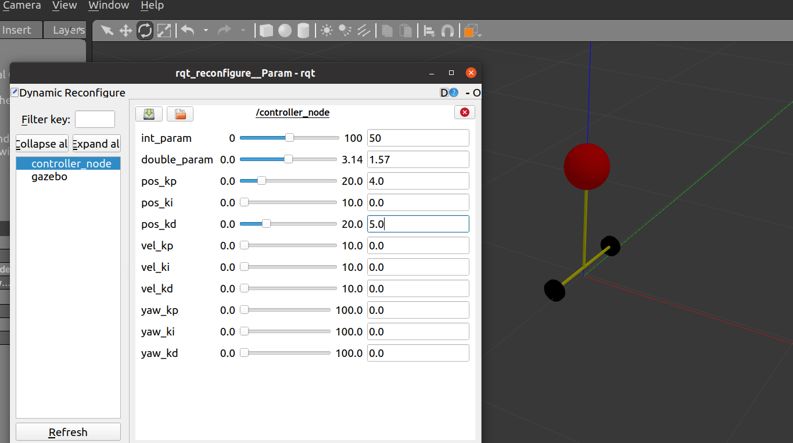
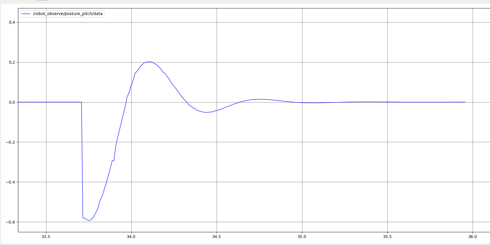
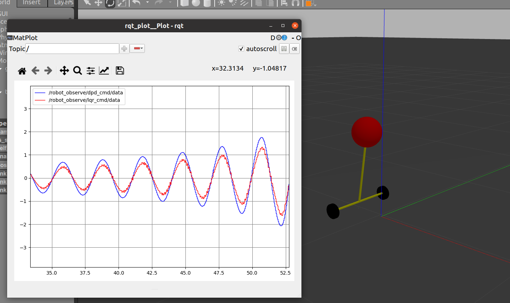

# BasicLQR 

---

归档状态：

修改记录：

- 20240409：建立此次实验。

---

## 文档说明：

本文档中的工程文件用于测试LQR能否用于WIP的控制。【根据人类文明的科研进度，必然是可以的】。在BasicWBR的实验当中，我尝试给WBR假装LQR控制器，LQR所基于的系统的状态空间方程是将WBR抽象成WIP模型后建立的，但是控制效果很糟糕。

我需要确定，问题是出在WBR的模型上，还是出现在我建立的WIP的动力学模型上。

于是有了这个实验。

## 本目录架构：

### /basicwip_ws:

​	 工程文件

## 重要文件说明：

### robotmodel.xacro

用于存放机器人urdf描述的文件。关于关节有一些值得说的地方：

## 重要工作记录

从2024年4月9日版本的BasicWBR中复制过来一个叫做controller的文件作为参考文件。

从中复制出并删改成为一个叫做controller2.cpp的文件。在将其中的各种不干净的东西删干净之后，使用了一下PD控制器控制平衡。

效果很好... .... ..... 

给WIP左右拖拽一下，施加一点小的扰动，得到的imu反馈俯仰角如下：

很快就在平衡方向收敛了。然后小车开始沿着扰动方向以一个速度前进hhh。

### 关于LQR控制器的调参之旅

Q = diag([0.1 100 0.1 0.1]);
R = 1;

效果如下：对比之前的单环PD控制，LQR的控制量要小

## 无法解释的BUG们

1. 机器人可控，但是无法通过topic将机器人的控制消息发送，然后用rqt_plot 来绘图。