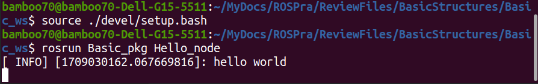
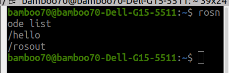

## ROS工程文件基本架构复习

---

【20240227 不用改动】

教程：http://www.autolabor.com.cn/book/ROSTutorials/chapter1/13-rosji-cheng-kai-fa-huan-jing-da-jian/131-helloworldshi-xian-jian-jie.html

基本上就是不依赖VScode 的情况下，手动建立一个ros工程文件，写一个ros包，在包里面写一个cpp代码。


## AT1: 节点名称(CPP版本)

​	Hello：		.cpp文件名
​	Hello_node:	add_executable(中的名字；
​	Hello_node:	target_link_libraries(中的名字；
​	hello:		以及.cpp 文件当中定义的节点的名字
​	
【为了研究这个问题，Hello.cpp中加了while(1)】

```cpp
#include "ros/ros.h"

int main(int argc, char * argv[])
{

ros::init(argc,argv,"hello");
ros::NodeHandle n;
ROS_INFO("hello world");
while(1);
return 0;
}
```

运行的时候，使用如下指令启动node：，使用的“Hello_node”是在CMake_List当中定义的名称。



运行后，使用rosnode list查看正在运行的节点



可以看见，节点的名称叫/hello 。

所以总体而言需要注意的区别就是这一处：代码当中定义的node名称在ros运行中使用；CMakeList定义的node名称在调用的时候使用。文件名在映射成为调用的名字之后就没啥用了。


## AT2：关于Cpp与Python

​	首先，两者互补，Cpp编码慢但是执行快；Python编码快但是执行慢；实际部署在产品上的代码感觉上应该都是用Cpp写的；

​	其次，总结下Ros包中两者使用的区别：
 	1. 在CMake_List中的使用方式不同。C++文件需要映射为节点，并且和lib链接，两步，然后才能编译；Python的配置在CMake_List当中走一步就行。
 	2. 执行的时候，同样是rosrun [pkg] [node]，C++文件对应的节点是CMake_List当中映射后的名称，这个名称可能不是节点在rqt中的名字；Python文件对应的就是 xxx.py的文件（启动时），同样的，rqt当中显示的节点名称将是rospy.init_node("xxx")中的xxx。
