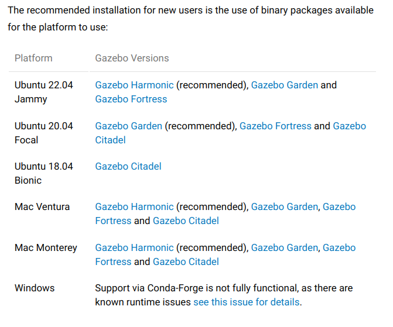
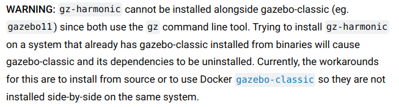
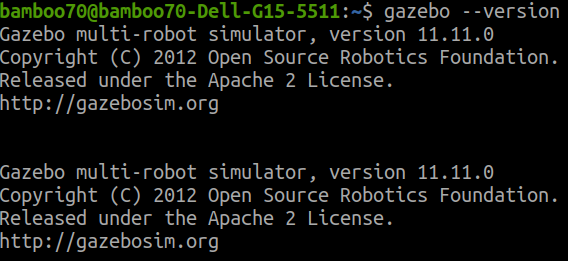
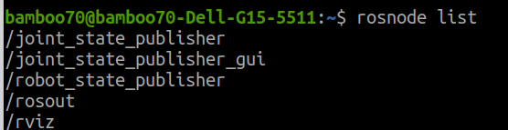
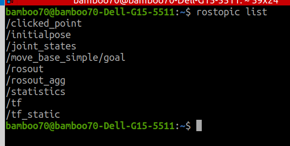
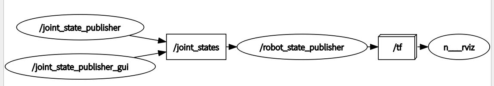
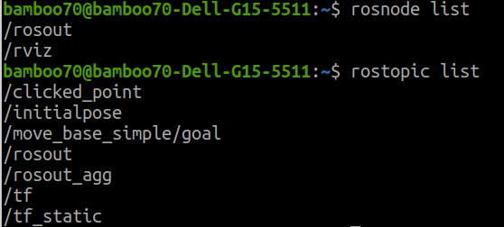
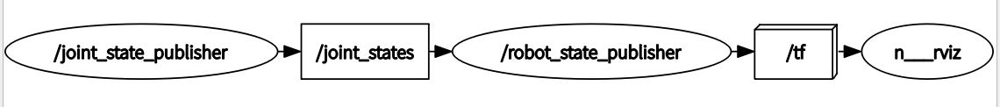
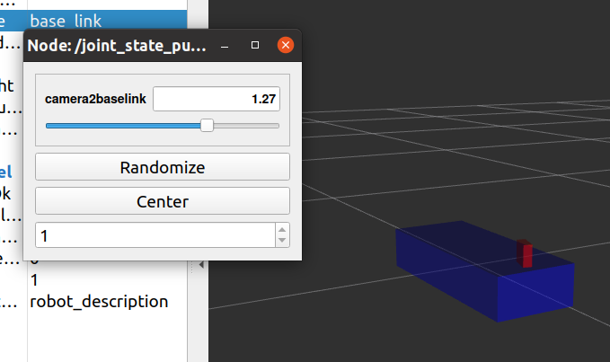

# urdf_ws 工程文件

---

本工程文件主要用于复习urdf 的使用。主要参考文章来源于[autolabor的教程](http://www.autolabor.com.cn/book/ROSTutorials/di-6-zhang-ji-qi-ren-xi-tong-fang-zhen.html)

【240229 首次完成】

【SN：记录的稍微有点细，如果你读这篇文章的时候已经有一段时间没有使用ros了，或许会有帮助】
【不过对于当下的这个整合者而言，他正在尝试快速构建自己的仿真环境，很多东西或许并没有记录的必要】


## - 一些背景知识

### URDF 

​	Unified Robot Description Format 统一（标准化）机器人描述格式。

​	一种XML方式描述机器人的结构。（Extensible Markdown Language）（那么为何不叫EMLwwww）

#### Robot标签

-  robot标签：urdf文件的根标签，所有的别的标签都包含在robot标签下。robot标签的属性name可以制定机器人的名字。

#### Link标签

- link标签：用于描述机器人的连杆。属性name可以标出连杆的名字
  - 子标签visual：外观
    - geometry：link形状（只是外观而已）
    - origin：link的偏移与转动角度（属性 xyz  rpy）
    - material：材料（属性：name）
      - color（属性 rgba [0,1]区间取值）
  - collision 碰撞属性（物理属性）
  - Inertial 惯性矩阵

#### Joint标签

用于描述机器人的运动学与动力学属性。也可以制定关节运动的极限。

joint可链接parent link 和 child link

- joint 属性name type（关节运动方式）
  - parent（上一个link）
  - child（下一个link）
  - origin（属性：xyz rpy）
  - axis（属性 xyz）用于设置绕哪一个轴转动

【SN：这么写估计一段时间回看的会后看是看不明白是啥，不如直接上代码，然后复现】

#### 辅助工具

##### - check_urdf :查看目录下urdf文件合法

##### - urdf_to_graphiz 查看urdf文件逻辑树

#### - launch文件当中的启动方式

```xml
<param name="robot_description" textfile="$(find demo01_urdf_helloworld)/urdf/urdf/test.urdf" />
```


### Xacro

#### - 基本结构

````xml
<robot name="xxx" xmlns:xacro="http://wiki.ros.org/xacro">
	... ...
</robot>
````

#### - 属性&算数

属性的定义：

```xml
<xacro:property name="xxxx" value="yyyy" />
```

属性的调用(以及数学表达式）：

```xml
${属性名}
${数学表达式}
```


#### - 宏

宏（基本上视为函数）定义方式：

```xml
<xacro:macro name="宏名称" params="参数列表(多参数之间使用空格分隔)">
    .....
    参数调用格式: ${参数名}
</xacro:macro>
```

宏调用：

```xml
<xacro:宏名称 参数1=xxx 参数2=xxx/>
```

#### - 多文件整合

```xml
<robot name="xxx" xmlns:xacro="http://wiki.ros.org/xacro">
      <xacro:include filename="my_base.xacro" />
      <xacro:include filename="my_camera.xacro" />
      <xacro:include filename="my_laser.xacro" />
      ....
</robot>

```

自然是，按顺序加载。

#### -launch文件中的启动方式

```xml
 <param name="robot_description" command="$(find xacro)/xacro $(find pkg)/xacro/robot.xacro" />
```


### Rviz

​	Ros Visualization Tool，是ROS的三维可视化工具。主要目标在于用三维的方式显示各种ROS消息。

### Gazebo版本

- (插一句：Rviz与gazebo： Rviz可显示机器人感知到的环境信息；Gazebo用于模拟一个外部环境；两者的作用因而是相当不同的

现在的gazebo版本似乎更新了，教程可能与实际使用的有出入。但是可用。
	【截止20240229】目前在gazebo网站上看到的推荐版本如图所示：



​	点开Ubuntu20.04的gz garden会看到如下的提示信息：



这个gazebo11 我是熟悉的，在command line 当中查询gazebo版本可以得到如下信息



显示的version就是11.11.0，所以可以判断我的系统上使用的是gazebo classic【在24年4月之前我应该不会动环境】


## - 功能包（们）

### 1 basic_urdf_pkg

#### robot1

【robot1.urdf + robot1.launch + robot1的rviz配置文件】

其中的urdf目录下定义的robot1.urdf文件

```xml
<robot name="mycar">
    <link name="base_link">
        <visual>
            <geometry>
                <box size="0.5 0.2 0.1" />
            </geometry>
        </visual>
    </link>
</robot>
```

最基本的标签。在urdf当中，robot是根标签，所有的link和joint以及别的标签都需要定义在robot根标签下面；

robot标签可以使用**属性**name来定义robot的名字。

SUM：XML中有标签，标签有属性和子标签。

#### robot2

【robot2.urdf + robot2.launch + robot2的rviz配置文件】

robot2主要是研究joint标签的使用。

##### [AT:in robot2] 关于joint states

在robot2相关的实验中，launch 文件里有以下内容：

```xml

    <!-- 添加关节状态发布节点 -->
    <node pkg="joint_state_publisher" type="joint_state_publisher" name="joint_state_publisher" />
    <!-- 添加机器人状态发布节点 -->
    <node pkg="robot_state_publisher" type="robot_state_publisher" name="robot_state_publisher" />
    <!-- 可选:用于控制关节运动的节点 -->
    <node pkg="joint_state_publisher_gui" type="joint_state_publisher_gui" name="joint_state_publisher_gui" />
```

启动了三个pkg当中的三个节点。

launch后启动的节点如下：【详细代码看工程文件，还有urdf和 rviz的】



创建的话题如下：



rqt_graph如下：



对比robot1实验当中launch启动后的内容：



node只有rviz。topic 除了/rosout /rosout_agg 以外是上述这些。rqt_graph 画不出来。

！所以，对比后可见多了/joint_states /statistics 两个topics

---

这里需要研究的是/joint_state_publisher /joint_state_publisher_gui /robot_state_publisher 这几个节点;
以及/joint_states /tf 等等话题。
这些内容在后续的关节控制当中还有继续出现的地方。

#### robot3

与2唯一的区别在于删除了joint_state_publisher_gui这个可以手动控制关节的pkg与其中的节点。




### 2 basic_xacro_pkg

在urdf基础上引入一些xacro的内容。[autolabor中关于xacro内容的介绍](http://www.autolabor.com.cn/book/ROSTutorials/di-6-zhang-ji-qi-ren-xi-tong-fang-zhen/64-fang-zhen-urdf-rviz-yu-gazebo-zong-he-ying-yong/652-xacroyu-fa-xiang-jie.html)

##### [AT：无法解释的问题rviz】

​	在我创建这个包的时候（无论我是复制上一个包，然后改CmakeList等配置文件中的名字，还是单独创建一个包），如果我使用basic_urdf_pkg当中关于rviz的配置文件，哪怕用同样的urdf和launch，在rviz中，小红方块会抖动（改变joint数值），明显能感觉到有两个数据源头在向/tf topic发送消息，一个是0位，还有一个是目标位置。



在不用原.rviz配置文件，改用重新配置之后，这个问题就解决了，不知道为什么。[又出问题了，我无法解释这个bug]

##### [TODO]

(见上)

---

xacro的使用教程可以接着看autolabor的教程。

主要注意的是在launch文件中的调用方式：

```xml
 <param name="robot_description" command="$(find xacro)/xacro $(find pkg)/xacro/robot.xacro" />
```

上面是xacro文件的调用方式，下面是urdf文件的调用方式：

```xml
<param name="robot_description" textfile="$(find demo01_urdf_helloworld)/urdf/urdf/test.urdf" />
```

【SN：launch文件的使用细节肯定还有很多，但是不需要太关心】