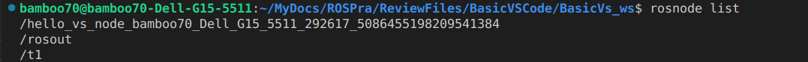

# 使用VSCode建立与编写ROS节点

---

【20240227 最后修改】


## AT1：关于.vscode 文件夹中各个文件的作用

​	这是一个经常困扰我的问题，不过话说回来其实也是一个不太需要关注的问题。

​    .vscode文件夹是VSCode编辑器的一个隐藏文件夹，用于存储项目的编辑器相关配置信息：

​	settings.json：				 代码格式化、自动保存、代码提示etc。
​	launch.json：	  			 启动调试器的配置信息。指定调试器类型、启动配置、调试选项。
​	tasks.json:						用于配置任务（task），任务是一组要执行的操作，如编译代码、运行测试等。
​	c_cpp_properties.json：  用于配置c/cpp编译器环境，头文件目录，c/cpp版本。

​	！！！！注意：本实验中所修改的就是tasks.json 文件，事关代码的编译功能，在本实验中，修改后将使得使用快捷键Ctrl+Shift+B就可以直接编译整个工程文件。相当于在ws目录下执行一次catkin_make

参考内容：

1. [vscode 配置tasks.json](https://juejin.cn/s/vscode%20%E9%85%8D%E7%BD%AEtasks.json)
2. [.vscode下面几个json文件的详细说明 ](https://blog.csdn.net/allenhsu6/article/details/131446381)


## AT2:中文支持

```cpp
/*
    控制台输出 HelloVSCode !!!

*/
#include "ros/ros.h"

int main(int argc, char *argv[])
{
    setlocale(LC_ALL,"");
    //执行节点初始化
    ros::init(argc,argv,"HelloVSCode");

    //输出日志
    ROS_INFO("Hello VSCode!!!哈哈哈哈哈哈哈哈哈哈");
    return 0;
}

```

在代码中使用 setlocale(LC_ALL,"");可以使用中文输出。具体原理暂不研究。

# Launch文件使用

---

这个示例当中同时包含了如何使用launch文件的相关内容。

## AT3: 重要细节

- ros::NodeHandle n; 并不是可有可无的一句话。如果不定义Handle的话，在控制台使用 rosnode list 是不能看到对应的节点的。

- 在launch文件中，如果为节点手动赋予了名字，那么将更新为launch文件中的名字。定义在原本代码中的nodename将会被覆写。

  ```xml
   <node pkg="basic_vs_pkg" type="hello_vs_node" name="Hello_Vscode_p" output="screen" />
  ```

  这里的name标签是无法省略的，如果写成name=""，将要得到的也不是定义在.cpp文件当中的节点名称，而是被缺省赋予的一个巨长的名字：

  

  使用了启动时候的节点称呼，并且在后面补上了很长的一串hhhh

- output="screen" 在使用launch文件启动节点的时候也是重要的，如果不写，在控制台当中就看不到输出的消息。程序确实执行了，代码也跑起来了，但是没有输出。
- 如果要跑python代码，type=“xxx.py”就行，与rosrun的逻辑是一样的。