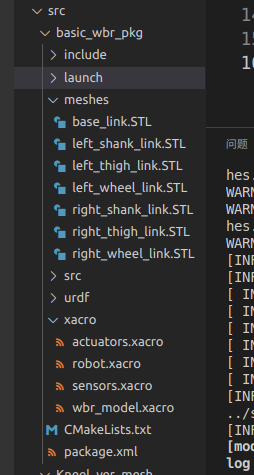
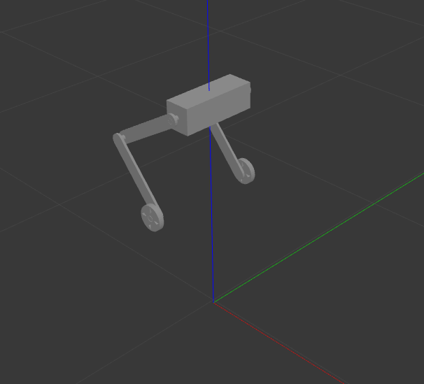
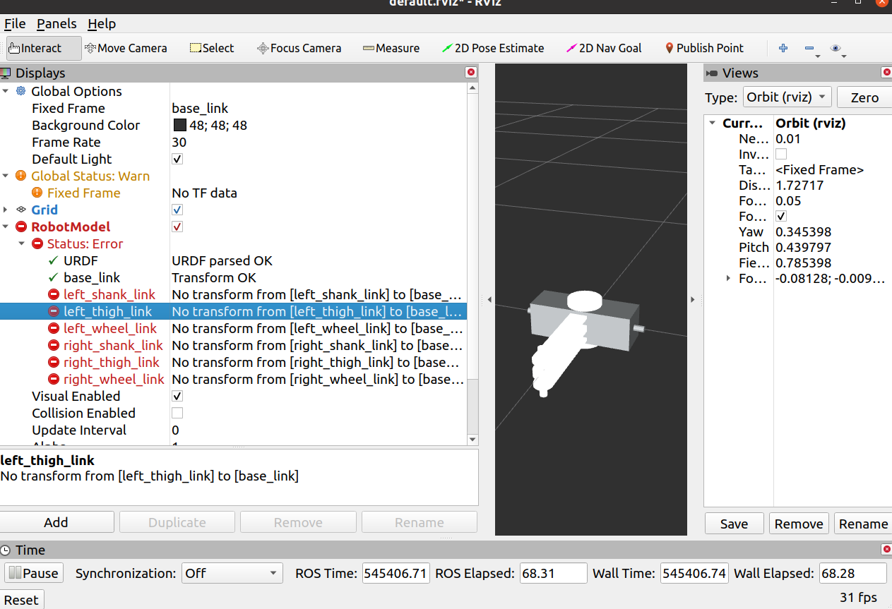
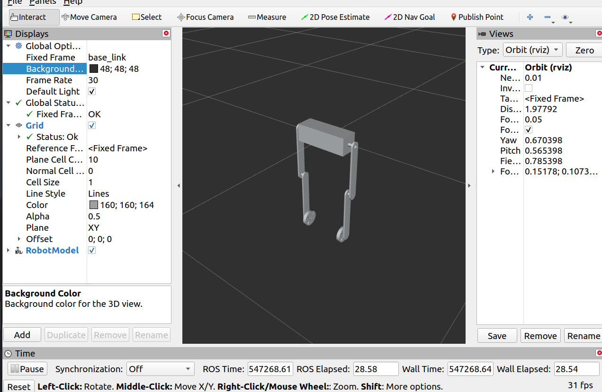
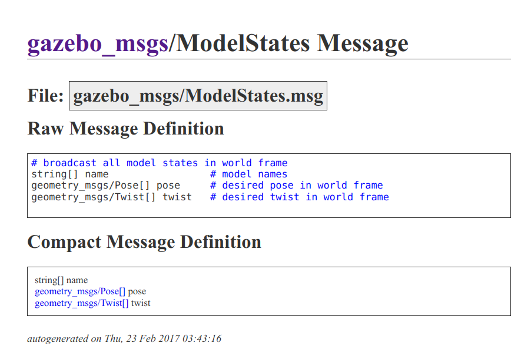
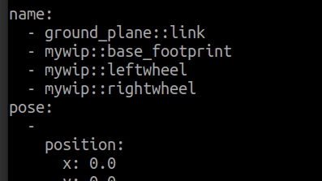

# BasicWBR_ws工程文件

---

主要记录基本的在Gazebo当中构建WBR的过程。

**非常重要的参考内容。**


本工程将会包括关于：

【仿真环境的基本配置： xacro + gazebo】

【仿真环境下的驱动器配置】

【仿真环境下的传感器配置】

【仿真环境中动态调试的基本配置】
	【yaml cfg】


## 工程基本概况

本工程记录最简单的双足轮腿机器人（wheeled Inverted Pendulum，WIP）的gazebo仿真实现流程。可以作为上手Gazebo机器人仿真的一种参考资料。


由于和WIP的工程相关程度比较高，这个Readme复制源于BasicWIP的Readme，并根据WBR的内容进行了相关的添加与删改。


## 一、仿真环境基本配置

系统：Ubuntu20.04 + ros-noetic + gazebo11（classical，后来改了版本了）


### 1.1功能包创建的依赖

```
dynamic_reconfigure gazebo_plugins gazebo_ros gazebo_ros_control roscpp rospy std_msgs urdf xacro
```

这些是创建一个基本WBR的ROS功能包所需要的一些依赖包。

### 1.2 导入URDF文件，改成Xacro

使用sw_urdf_export 将solidworks文件转换成urdf文件生成的是一个可以直接执行的ros功能包。里面自带launch文件，可以在rviz或者是gazebo当中打开。

本工程不直接使用这个生成的pkg，而是单独建立一个pkg，原先pkg当中的urdf文件复制到新的包当中，加以管理和修改。

需要复制过来的文件有meshes目录和urdf目录。（原先的那个包会生成一堆乱七八糟的文件，不是很需要关心其中的内容）

但是urdf文件可以改成xacro，方便其他xacro文件对其进行调用，并添加后续的gazebo控制插件等等。




上图为本工程涉及到的机器人内容，wbr_model.xacro为机器人模型描述，actuators为执行器，用于绑定驱动器；sensors为传感器，用于绑定传感器）

第二步是在launch文件中进行基本的gazebo启动：

```xml
<launch>

  <!-- <param name="robot_description" textfile="$(find basic_wbr_pkg)/xacro/robot.xacro" /> -->
  <param name="robot_description" command="$(find xacro)/xacro $(find basic_wbr_pkg)/xacro/robot.xacro" />


  <include file="$(find gazebo_ros)/launch/empty_world.launch" />

  <node
    name="model"
    pkg="gazebo_ros"
    type="spawn_model"
    args="-urdf -model robot -param robot_description -z 1"
    output="screen" />

</launch>
```

没有bug就会在gazebo当中启动模型（不过没有控制器，很快会倒下）




## 二、驱动器基本配置

本部分主要研究如何在gazebo中导入机器人模型的基础上，给机器人的关节添加驱动器，从而可以控制机器人的关节运动。

### 2.1 transmission

[对urdf中transmission的官方说明](http://wiki.ros.org/urdf/XML/Transmission)。

transmission标签用于描述**驱动器**与**关节**的关系【教程已经讲得很清楚了，这里就不记录了】

【需要额外说明的是：Hardware Interfaces 似乎有非常多的选择，目前可能用不到太多，不过可以日后加以注意】


### 2.2 gazebo_ros_control

```xml
    <gazebo>
        <plugin name="gazebo_ros_control" filename="libgazebo_ros_control.so">
            <robotNamespace>/robot_wbr</robotNamespace>
        </plugin>
    </gazebo>
```


### 2.3 yaml 文件

和GNU操作系统命名有点像， 递归命名， GNU's Not Unix。

YAML似乎是： YAML  Ain't a Markup Language ： YAML不是一个标记语言。（不过一说 Yet Another Markup Language）。当个小乐子看看就好。

定义robot_wip.yaml文件：

```yaml
robot_wbr:
  # Publish all joint states -----------------------------------
  joint_state_controller:
    type: joint_state_controller/JointStateController
    publish_rate: 50  

  # Position Controllers ---------------------------------------
  Lw_ctrl:
    type: effort_controllers/JointEffortController
    joint: left_wheel_joint
    pid: {p: 100.0, i: 0.01, d: 10.0}
  Rw_ctrl:
    type: effort_controllers/JointEffortController
    joint: right_wheel_joint
    pid: {p: 100.0, i: 0.01, d: 10.0}

  Lk_ctrl:
    type: effort_controllers/JointPositionController
    joint: left_knee_joint
    pid: {p: 100.0, i: 0.01, d: 10.0}
  Rk_ctrl:
    type: effort_controllers/JointPositionController
    joint: right_knee_joint
    pid: {p: 100.0, i: 0.01, d: 10.0}
  Lh_ctrl:
    type: effort_controllers/JointPositionController
    joint: left_thigh_joint
    pid: {p: 100.0, i: 0.01, d: 10.0}
  Rh_ctrl:
    type: effort_controllers/JointPositionController
    joint: right_thigh_joint
    pid: {p: 100.0, i: 0.01, d: 10.0}


```

整个6自由度的机器人包含4个位置控制器和2个轮子的力矩控制器。

### 2.4 launch 文件

```xml
<!-- 以下部分是新加入的关于控制相关的内容 -->
    <!-- 1 Load joint controller configurations from YAML file to parameter server -->
    <rosparam file="$(find basic_wip)/yaml/robot2.yaml" command="load"/>
    <!-- 2 load the controllers -->
    <node name="controller_spawner" pkg="controller_manager" type="spawner" respawn="false"
        output="screen" ns="/robot_wip" args="
        joint_state_controller 
        Lwheel_effort_controller
        Rwheel_effort_controller"
        />


    <!-- 启动自己写的控制节点 -->
    <node pkg="basic_wip" type="wip_ctrl_node" name="wip_controller"  output="screen" respawn ="true">
        <!-- <rosparam file="$(find basic_wip)/cfg/defaultpidpara.yaml" command="load"/> -->
    </node> 

```

打开yaml文件，启动对应的控制器，下面的node是本文第四章所用的控制器。


## 三、传感器基本配置

本部分主要研究如何在gazebo中导入机器人模型的基础上，如何绑定特定的传感器，以及读取和处理传感器消息。

绑定IMU模块

```xml
  <!-- IMU plugin for 'imu_link' ， 实际上，由于imu与body是固连的，所以直接绑定body（此工程中base_link）也ok-->
  <gazebo reference="imu_link">
    <gravity>true</gravity>
    <sensor name="imu_sensor" type="imu">
      <always_on>true</always_on>
      <update_rate>100</update_rate>
      <visualize>true</visualize>
      <topic>__default_topic__</topic>
      <plugin filename="libgazebo_ros_imu_sensor.so" name="imu_plugin">
        <topicName>imu</topicName>
        <bodyName>imu_link</bodyName>
        <!-- 此处也有一个bodyName -->
        <updateRateHZ>100.0</updateRateHZ>
        <gaussianNoise>0.0</gaussianNoise>
        <xyzOffset>0 0 0</xyzOffset>
        <rpyOffset>0 0 0</rpyOffset>
        <frameName>imu_link</frameName>
        <!-- 这个frameName是否可以使用imu_link 需要经过测试，因为原本这个代码的参考bodyName并非imu_link，这是我起的link名字 -->
      </plugin>
      <pose>0 0 0 0 0 0</pose>
    </sensor>
  </gazebo>

```

绑定到imu_link上。


## 四、控制器编写

控制器需要完成的工作内容主要有三个部分：

- 读取IMU模块的消息
- 使用PD控制器解算轮子力矩
- 将计算后的轮子力矩发送到对应的TOPIC上，完成控制

主要的代码部分如下：

### 4.1 Robot_Class , 定义一个机器人类

### 4.2 定义IMU的回调函数

### 4.3 主循环的收发逻辑

（时间关系这些地方没有把代码粘贴过来，可以直接去看code）

## 五、【TODO】额外配置

### 5.1 【TODO】动态调参插件

### 


## 六、Bugs

这里是各种bug。

### 机器人模型坍缩



这个问题原先出现在gazebo当中，我发现位置控制器不起效果，然后过一会儿，机器人的模型就会像上图rviz当中一样探索在一起。

不过好在，rviz给出了可能的原因，rviz表明，关节之间的tran不在了。

- 首先，

  - ​    <node name="joint_state_publisher" pkg="joint_state_publisher" type="joint_state_publisher" /> 似乎是必要的launch 文件内容。在之前的WIP文件当中，我尝试删除了这句话，然后rviz当中虽然没有坍缩，但部分关节之间也出现了 No transform from  的问题。 
  - 但是有这句并没解决当前我遇到的问题。
  - [!!!!!] 后面的调试过程中出现了即使写了这句话也没有用的情况。。。 。。。 重启roscore后就又ok了。我不理解

   

- 初步解决：

- 

  - 我的修改内容在于，在launch 文件当中，删除了启动robot_state_publisher pkg下的 robot_state_publisher 节点中的两行：

  - ```xml
        <node name="robot_state_publisher" pkg="robot_state_publisher" type="robot_state_publisher"
            respawn="false" output="screen">
        </node>
    ```

    这个是修改前的版本

  - ```xml
        <node name="robot_state_publisher" pkg="robot_state_publisher" type="robot_state_publisher">
        </node>
    ```

    这个是修改后的。简单来说就是把respawn 和 output两项给删掉了。

    ​	这之后。rviz 的Global Options选项下的Fixed Frame 就可以选取BaseLink了；并且所有的transform都正常了。 

- 我当时为什么会写这个 respawn = "false" output = "screen" 来着... ... 

- 然后让我们回到gazebo尝试一下，得，还是有问题， 模型导入之后首先是肌无力（没法运动）

## 末、相关知识内容记录

### L.1 gazebo_msgs

#### /gazebo/model_states



在gazebo当中，modelstates包含三个数组，名为name的字符串数组；名为pose 的 属于标准ros geometry_msgs/Pose 类型的数组；以及twist数组。

在导入机器人模型的时候，名为mywip的整体会作为gazebo仿真环境发布model_states的一个对象。

```xml
    <node pkg="gazebo_ros" type="spawn_model" name="model" args="-urdf -model mywip -param robot_description"  />

```

使用 rostopic echo /gazebo/model_states 可以查看：


name数组表示：当前的models有两个，第一个是平面（空世界自带的），第二个是我们导入的wip模型；
pose数组对应的显示了两组pos和orientation，表示了平面和机器人的位姿。
twist不展示了，同理是两组linear和angular。

#### /gazebo/link_states

这个topic会显示所有的link。这样就包含了wip模型下辖的links。不过似乎只包含了存在相对运动的links，对于固连的link，似乎会选择忽略：




#### /clock

类型： rosgraph_msgs/Clock

根据ros.org [官网上的介绍](http://wiki.ros.org/rosgraph_msgs),从属于rosgraph_msgs的topics都属于底层的topic，是不希望用户去动的。

在gazebo环境当中：

Reset world，将会导致/clock topic重置，重新从0开始计时；

Reset model pose，则不会导致/clock topic变化。

！！！【TODO：之前做仿真的时候，每次使用reset world会导致控制器失效，这次看看能不能研究明白怎么回事】


### L.2 urdf可以用的标签

这里有一个ros.org 当中[描述urdf中有可以有那些标签的网页](http://wiki.ros.org/urdf/XML)


### L.3 Ros_control

此部分用于整理关于ros_control的相关知识【之前这部分就没有完整的处理过】

参考文章：

- [ros.org当中对ros_control的介绍](https://wiki.ros.org/ros_control)，对于ros_control的描述是：包含了controller interfaces \ controller managers \ transmissions \ hardware_interfaces 的一系列包。这里也有不少link可以指向更多的相关资料。
- [知乎文章：ros_control 基础知识](https://zhuanlan.zhihu.com/p/431279381)


#### ros_control 官网说明笔记

​	ros_control 是对 pr2_mechanism 包的重写，目的是将其推广到除了PR2以外的更多的机器人控制上。

[gazebo上对ros_control的说明](https://classic.gazebosim.org/tutorials?tut=ros_control)

