# WBR_Robot_Control_Learning

## 说明

记录如何在gazebo中实现机器人的位置控制、力矩控制、双环PD控制。

【SN：基本上就是复现一下本科毕设的工作内容】

### 一些常用复制：

#### .vscode/tasks.json file

```json
{
// 有关 tasks.json 格式的文档，请参见
    // https://go.microsoft.com/fwlink/?LinkId=733558
    "version": "2.0.0",
    "tasks": [
        {
            "label": "catkin_make:debug", //代表提示的描述性信息
            "type": "shell",  //可以选择shell或者process,如果是shell代码是在shell里面运行一个命令，如果是process代表作为一个进程来运行
            "command": "catkin_make",//这个是我们需要运行的命令
            "args": [],//如果需要在命令后面加一些后缀，可以写在这里，比如-DCATKIN_WHITELIST_PACKAGES=“pac1;pac2”
            "group": {"kind":"build","isDefault":true},
            "presentation": {
                "reveal": "always"//可选always或者silence，代表是否输出信息
            },
            "problemMatcher": "$msCompile"
        }
    ]
}

```

#### ros pkg 依赖

```
dynamic_reconfigure gazebo_plugins gazebo_ros gazebo_ros_control roscpp rospy std_msgs urdf xacro
```

​	假设xacro文件（urdf文件）没有什么问题。


## 1. sw导入urdf

这一步坑比较多，机器人的转动轴方向，机器人关节坐标系的方向。都有可能和你在导出的时候选择的不一样。

如果发现什么别的问题，我会在这里进行补充。

### 一份sw2urdf的导出笔记

在此次尝试之前，已经完成了对于roscontrol在gazebo当中实现力控制与位置控制的实验了。

因此这次如果能够完成WBR的 成功导出，应该就可以很方便地实现WBR的基本代码架构。

#### 左腿


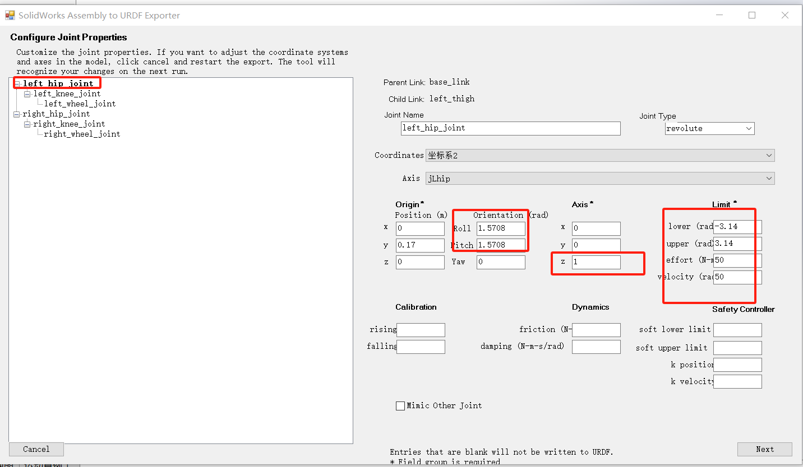

左腿大腿：所有的内容都是正确的。补充了转动关节的关节限位信息


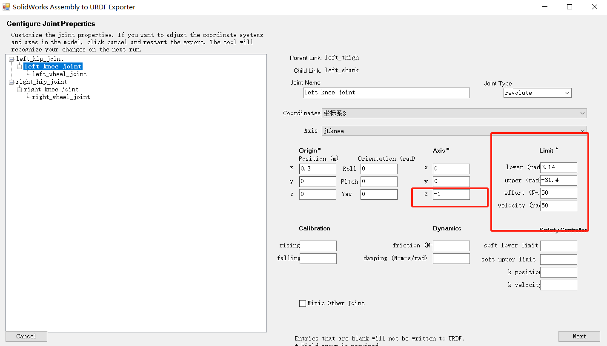

左腿小腿&膝关节。

这里有趣的地方在于，为什么z轴是-1。我不是很理解。暂时不动。补充转动关节的限位信息。

【这里写错了，最大角度写成了-31.4，最小是3.14，写反了hhh】


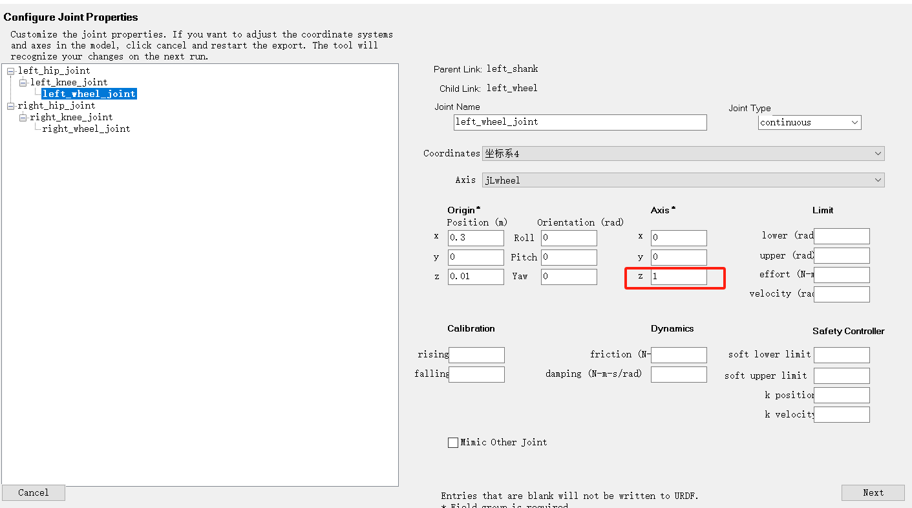

左轮，这会儿，左轮关节转轴和膝关节转轴重合了。逗。


#### 右腿

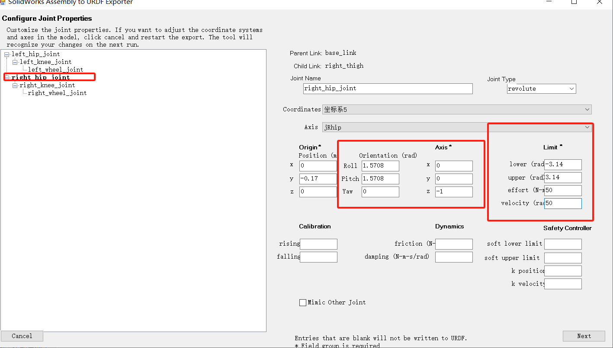

右侧大腿和髋关节，坐标系没问题（我就是这么设置的，和左腿髋关节一样）

但是。 转动方向是-1，淦。

补充转动关节的限位信息。


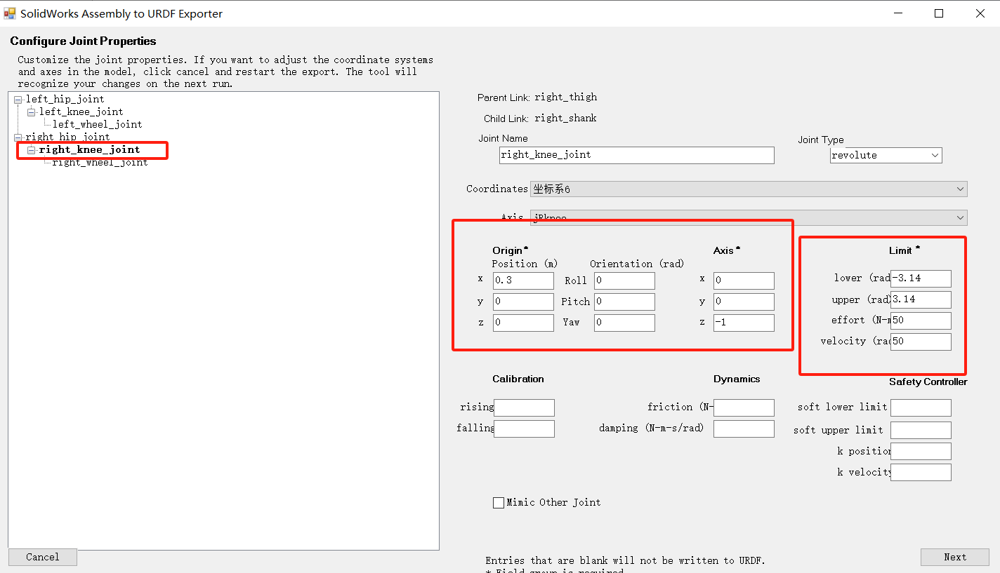

右侧小腿和膝关节。

相对于右侧大腿，转动方向又tm变了（有完没完）

补充关节限位。


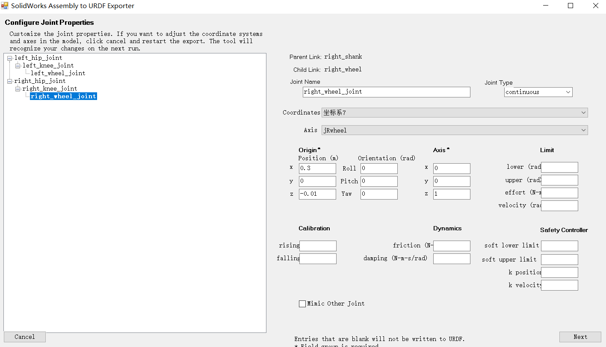

最后是右轮。

关节和右侧膝关节方向保持一致。

连续转动关节不需要限定关节参数。


以上，准备导出。


好消息，直接用rviz可以打开，坏消息，为什么长这个样子：

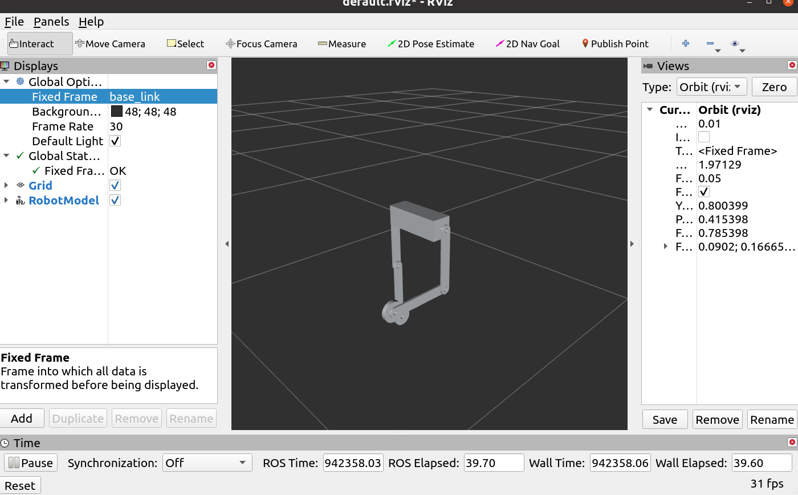

很奇怪，至少上面的内容当中，左腿的膝关节并没有转动这一说....


#### 修改1：转轴方向

修改所有的转动方向为1

```xml
  <joint
    name="right_hip_joint"
    type="revolute">
    <origin
      xyz="0 -0.17 0"
      rpy="-1.5708 1.5708 0" />
    <parent
      link="base_link" />
    <child
      link="right_thigh" />
    <axis
      xyz="0 0 1" />
    <limit
      lower="-3.14"
      upper="3.14"
      effort="50"
      velocity="50" />
  </joint>

```

即axis当中的-1改成1，如上图所示（剩下的5个关节同理）

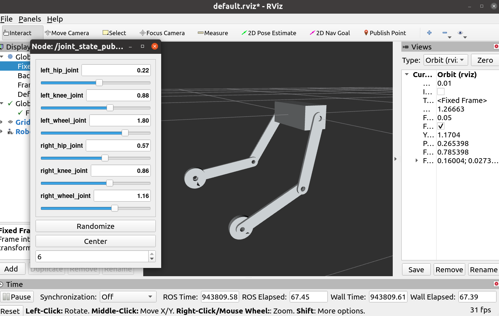

结果发现，所有的转动（正方向全是反的.... ... 这是为什么呢？我也不晓得hhh）

想了一下r = 1.57 p = 1.57 对应的结果z是朝向机器人右侧的... ... 

看了一下，正好图中的模型和实际上的模型是反着的，

好你个sw2urdf

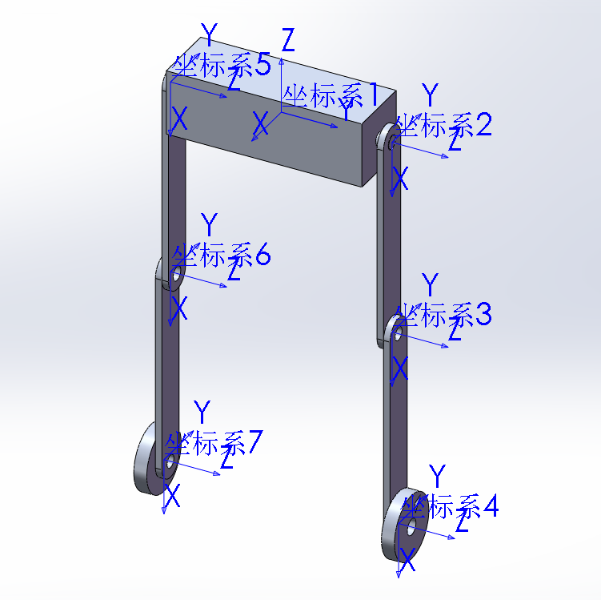

说明：这个轮子是在外面的，你看上面那个rviz，明显轮子在内侧，就是此图中的坐标系2、5 出了问题。

#### 修改2：坐标系关系

将左右Hip_Link相对于机器人身体的关节映射修改一下， 改成预先设计好的z轴朝向左侧的设计

（我有点不敢用sw2urdf的插件了... ... 害怕）

```xml
  <joint
    name="right_hip_joint"
    type="revolute">
    <origin
      xyz="0 -0.17 0"
      rpy="-1.5708 1.5708 0" />
    <parent
      link="base_link" />
    <child
      link="right_thigh" />
    <axis
      xyz="0 0 1" />
    <limit
      lower="-3.14"
      upper="3.14"
      effort="50"
      velocity="50" />
  </joint>  
```

将 <origin 下面的 rpy 的r 加一个负号，改成 -1.5708

正常了：

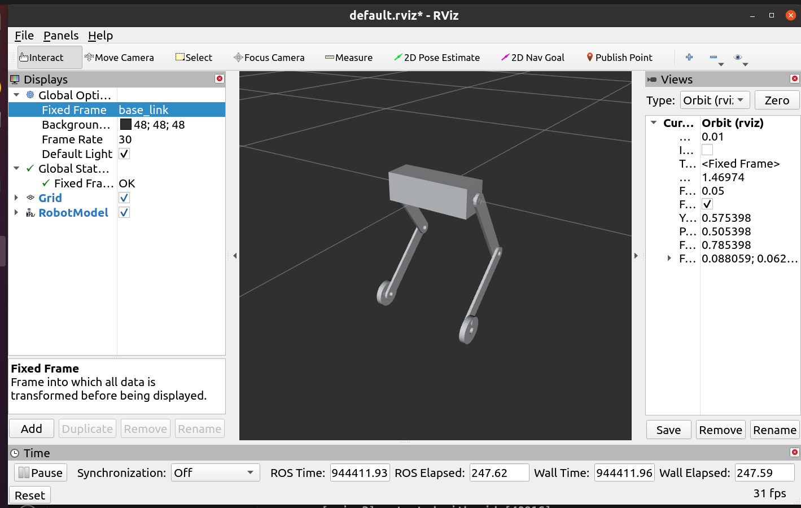

## 2. urdf移植工作

​	经过检测和调整的urdf（从sw导出），可以移植到新的工程文件当中了。

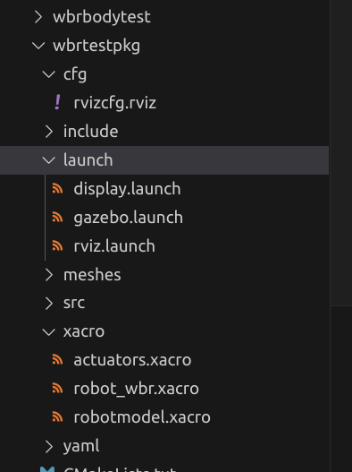

工作空间中的wbrbodytest，是sw导出的urdf文件。wbrtestpkg，是ros包。

需要的修改如下：

#### 1、xacrot移植

**将机器人urdf文件放到包目录的xacro目录下，改成xacro文件格式（方面后面调用）**


新建一个robot_wbr.xacro文档，作为引用其他文件的文件。

```xml
<robot name="robot_wbr" xmlns:xacro="http://wiki.ros.org/xacro">
    <xacro:include filename="robotmodel.xacro" />
    <!-- 调用机器人模型 -->
    <xacro:include filename="actuators.xacro" />
    <!-- 绑定机器人驱动器（注意关节类型）+ 开启gazebo_ros_control 插件（注意命名空间）-->
    <xacro:include filename="sensors.xacro" />
    <!-- 绑定外部传感器（内部传感器可以通过机器人状态读取） -->
</robot>
```

这里没写的文件之后会说，因此调试时候可以将actuators和sensors注释掉。

#### 2、mesh 文件

将mesh文件复制过来，放到包目录下。

毕竟引用了mesh文件的东西。


#### 3、launch 文件

将launch文件复制过来，测试一下好不好用。

新建一个rviz.launch 文件，将原有的display.launch复制过来，然后修改如下内容：

```xml
    
    <param 
    name="robot_description" 
    command="$(find xacro)/xacro $(find wbrtestpkg)/xacro/robot_wbr.xacro" />
```

将param 当中的robot_description 修改成如上内容。

然后启动launch文件，如果万无一失就能看到模型了，这个时候保存一下rviz设置到 包目录下的cfg/目录下。

下一次启动就可以在rviz包和节点中添加以下内容了：

```xml
  <node
    name="rviz"
    pkg="rviz"
    type="rviz"
    args="-d $(find wbrtestpkg)/cfg/rvizcfg.rviz" />
```

## 3、控制器插件

### 3.1 transmission

编辑actuators.xacro文件,全文如下：

按照：力矩宏；位置宏；力矩对应关节；位置对应关节；打开gazebo_ros_control 的顺序

```xml
<robot name = "actuators" xmlns:xacro = "http://wiki.ros.org/xacro">

    <!-- 力矩控制的Interface xacro宏定义 -->
    <xacro:macro name="Effor_transmission_macro" params = "joint_name">
        <transmission name="${joint_name}_transmission">
            <type>transmission_interface/SimpleTransmission</type>

            <joint name="${joint_name}">
                <hardwareInterface>hardware_interface/EffortJointInterface</hardwareInterface>
                <!-- 在 Gazebo      当中用 ： EffortJointInterface -->
                <!-- 在 RobotHW     当中用 ： hardware_interface/EffortJointInterface -->
            </joint>

            <actuator name="${joint_name}_motor">
                <mechanicalReduction>1</mechanicalReduction>
                <hardwareInterface>hardware_interface/EffortJointInterface</hardwareInterface>
                <!-- 在 Indigo 之前的版本，hardwareInterface只在此处定义（和我noetic什么关系x） -->
            </actuator>
        </transmission>
    </xacro:macro>

    <!-- 位置控制的Interface xacro宏定义 -->
    <xacro:macro name="Position_transmission_macro" params = "joint_name">
        <transmission name="${joint_name}_transmission">
            <type>transmission_interface/SimpleTransmission</type>

            <joint name="${joint_name}">
                <hardwareInterface>hardware_interface/PositionJointInterface</hardwareInterface>
                <!-- 在 Gazebo      当中用 ： EffortJointInterface -->
                <!-- 在 RobotHW     当中用 ： hardware_interface/EffortJointInterface -->
            </joint>

            <actuator name="${joint_name}_motor">
                <mechanicalReduction>1</mechanicalReduction>
                <hardwareInterface>hardware_interface/PositionJointInterface</hardwareInterface>
                <!-- 在 Indigo 之前的版本，hardwareInterface只在此处定义（和我noetic什么关系x） -->
            </actuator>
        </transmission>
    </xacro:macro>


    <!-- 使用力控的关节 -->
    <xacro:Effor_transmission_macro joint_name="right_wheel_joint" />
    <xacro:Effor_transmission_macro joint_name="left_wheel_joint" />

    
    <!-- 使用位置控制的关节 left_hip_joint -->
    <xacro:Position_transmission_macro joint_name="right_knee_joint" />
    <xacro:Position_transmission_macro joint_name="right_hip_joint" />
    <xacro:Position_transmission_macro joint_name="left_knee_joint" />
    <xacro:Position_transmission_macro joint_name="left_hip_joint" />


    <!-- 启动gazebo_ros_control 插件，命名空间设置为/robot_wbr -->
    <gazebo>
        <plugin name="gazebo_ros_control" filename="libgazebo_ros_control.so">
            <robotNamespace>/robot_wbr</robotNamespace>
        </plugin>
    </gazebo>

</robot>

```

这样就为机器人模型中的各个关节绑定了对应的控制器。

### 3.2 yaml文件

在使用launch文件启动controller_manager包中的controller_spawner节点之前，需要先在yaml文件中定义好各个关节的控制器，这样之后才能打开。

```yaml
robot_wbr:
  # 本包的机器人命名空间是robot_wbr;
  # Publish all joint states -----------------------------------
  joint_state_controller:
    type: joint_state_controller/JointStateController
    publish_rate: 50  

  # Effort Controllers   ---------------------------------------

  my_effort_controller:
    type: effort_controllers/JointEffortController
    joint: right_wheel_joint
    pid: {p: 100.0, i: 0.01, d: 10.0}
  my_effort_controller:
    type: effort_controllers/JointEffortController
    joint: left_wheel_joint
    pid: {p: 100.0, i: 0.01, d: 10.0}

  # Position Controllers ---------------------------------------
  right_knee_ctrl:
    type:  position_controllers/JointPositionController
    joint: right_knee_joint
    pid: {p: 100.0, i: 0.01, d: 10.0}
  right_hip_ctrl:
    type:  position_controllers/JointPositionController
    joint: right_hip_joint
    pid: {p: 100.0, i: 0.01, d: 10.0}
  left_knee_ctrl:
    type:  position_controllers/JointPositionController
    joint: left_knee_joint
    pid: {p: 100.0, i: 0.01, d: 10.0}
  left_hip_ctrl:
    type:  position_controllers/JointPositionController
    joint: left_hip_joint
    pid: {p: 100.0, i: 0.01, d: 10.0}


/gazebo_ros_control:
  pid_gains:
    right_knee_joint:
      p: 100.0
      i: 0.01
      d: 10.0
    right_hip_joint:
      p: 100.0
      i: 0.01
      d: 10.0
    left_knee_joint:
      p: 100.0
      i: 0.01
      d: 10.0
    left_knee_joint:
      p: 100.0
      i: 0.01
      d: 10.0
```

### 3.3 launch 文件

编写launch文件，调用机器人模型，调用控制器，打开gazebo。

完整文件如下，按照注释分成了不同的部分。

```xml
<launch>
    <arg name="wbr_model" />

    <!-- 将机器人模型加载到参数服务器当中 -->
    <param 
    name="robot_description" 
    command="$(find xacro)/xacro $(find wbrtestpkg)/xacro/robot_wbr.xacro" />

    <!-- 启动 gazebo ，打开一个空世界（之后可以放一些障碍物我猜）-->
    <include file="$(find gazebo_ros)/launch/empty_world.launch" />

    <!-- 在 gazebo 中显示机器人模型 -->
    <node pkg="gazebo_ros" type="spawn_model" name="model" args="-urdf -model my_wbr -param robot_description"  />


    <!-- 以下部分是新加入的关于控制相关的内容 -->
    <!-- 1 Load joint controller configurations from YAML file to parameter server -->
    <rosparam file="$(find wbrtestpkg)/yaml/controllers.yaml" command="load"/>
    <!-- 2 load the controllers -->
    <node name="controller_spawner" pkg="controller_manager" type="spawner" respawn="false"
        output="screen" ns="/robot_wbr" args="
        joint_state_controller 
        right_wheel_ctrl
        left_wheel_ctrl
        right_knee_ctrl
        right_hip_ctrl
        left_knee_ctrl
        left_hip_ctrl
        "
        />

  <node
    name="joint_state_publisher"
    pkg="joint_state_publisher"
    type="joint_state_publisher" />
  <node
    name="robot_state_publisher"
    pkg="robot_state_publisher"
    type="robot_state_publisher" />


</launch>


```


### 测试控制器的配置

记得在xacro文件中调用actuators.xacro文件。

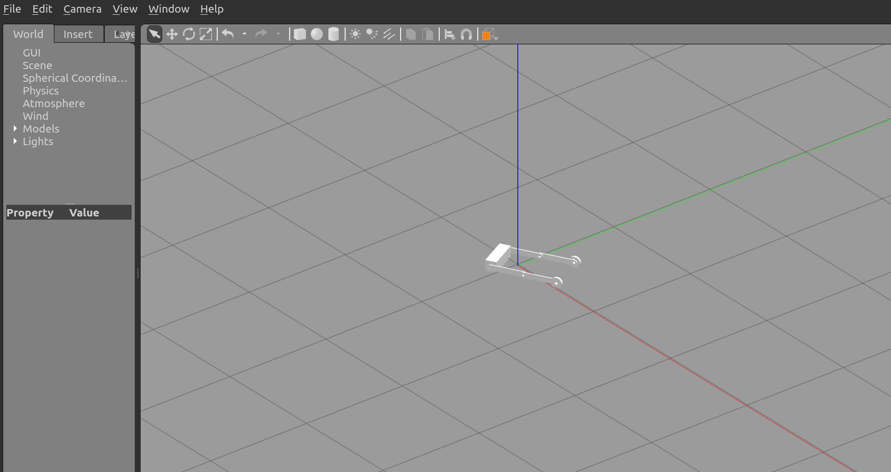


## 4、 编写控制节点

控制节点需要的话题： namesapce + 控制器 + command：

下面是控制器（double_pd_control.cpp）while(1)之前的一段代码，定义了对应的6个指令发布者。

```cpp
    // 控制器相关，话题发布
    // 左右腿的位置控制
    ros::Publisher LeftHipCmdPub = nt.advertise<std_msgs::Float64>("/robot_wbr/left_hip_ctrl/command",10);
    ros::Publisher RightHipCmdPub = nt.advertise<std_msgs::Float64>("/robot_wbr/right_hip_ctrl/command",10);
    ros::Publisher LeftKneeCmdPub = nt.advertise<std_msgs::Float64>("/robot_wbr/left_knee_ctrl/command",10);
    ros::Publisher RightKneeCmdPub = nt.advertise<std_msgs::Float64>("/robot_wbr/right_knee_ctrl/command",10);
    

    // 左右轮的运动控制
    ros::Publisher LeftWheelCmdPub = nt.advertise<std_msgs::Float64>("/robot_wbr/left_wheel_ctrl/command",10);
    ros::Publisher RightWheelCmdPub = nt.advertise<std_msgs::Float64>("/robot_wbr/right_wheel_ctrl/command",10);
    
```

至于消息的类型std_msgs::Float64 这个可以使用 rostopic type /robot_wbr/xxx/command 查询到(xxx替换为对应的控制器)

之后，定义一些个数据：

```c++
    std_msgs::Float64 BalanceCmdMsg; //控制指令
    std_msgs::Float64 HipPosMsg;
    std_msgs::Float64 KneePosMsg;
```

然后再while（1）当中发布这些内容：

```c++
	//发送控制指令。	
    HipPosMsg.data = 0.7854;
    KneePosMsg.data = -1.5708;
    BalanceCmdMsg.data = 0.05;

    LeftHipCmdPub.publish(HipPosMsg);
    LeftKneeCmdPub.publish(KneePosMsg);
    RightHipCmdPub.publish(HipPosMsg);
    RightKneeCmdPub.publish(KneePosMsg);

    LeftWheelCmdPub.publish(BalanceCmdMsg);
    RightWheelCmdPub.publish(BalanceCmdMsg);
```

这些基础的代码将完成对于机器人的基本的关节控制。

编写完整的代码之后（见这一节的最后一段附录代码），编译，并在launch文件当中启动控制节点：

```xml
  <node pkg = "wbrtestpkg" type = "dpd_ctrl_node" name = "dpd_ctrl_node" />
```

附一段完整代码，里面有很多注释还没有取消掉：

```cpp
/*
 * 双足轮退机器人的控制代码，给予倒立摆模型设计。
 * 机器人约束如下：
 * 1. 机器人的两腿同步运动。 （左右膝关节；左右髋关节；使用相同指令）
 * 2. 倒立摆模型，并且有：机器人的髋关节、膝关节使用位置控制，根据高度解算位置。
 * 3. 双环pd控制器：
 *          - 平衡pd控制：输入角度，输出力矩；
 *          - 速度pd控制：输入参考速度，输出角度；
 * 
*/
#include "ros/ros.h"
#include "std_msgs/String.h"
#include "std_msgs/Float64.h"

#include <sstream>
#include "geometry_msgs/Twist.h"

#include "math.h"

//尝试读取机器人轮子的位置信息，然后实现一个针对位置计算速度的观测器。
// 可以尝试和直接读取的vel进行对比，看看这个观测器写的对不对。
#include "std_msgs/Header.h"
#include "sensor_msgs/JointState.h"

//部署传感器
#include "sensor_msgs/Imu.h"


//定义一个机器人Class ，包含关于运动当中的各种所需属性。
class Robot_Class{
    public:
        float mass_body;
        float mass_both_thigh;
        float mass_both_shank;
        float mass_total;

        //所有变量使用小写打头，下划线|非个单词的大驼峰来命名。
        float orientation_yaw; //rad
        float orientation_pitch; //rad
        float orientation_roll; //rad

        //平衡控制设计到的属性
        float balance_pid_kp;
        float balance_pid_ki;
        float balance_pid_kd;
        float balance_last_error;
        float balance_target;  // rad
        float balance_calculated_effort; // N`m
        bool  balancePidFirstFlag; //是否首次开启平衡控制。

        //速度控制设计到的属性
        float vel_pid_kp;
        float vel_pid_ki;
        float vel_pid_kd;
        float vel_pid_last_error;
        float vel_target;  // rad
        float vel_pid_calculated_pos; // rad
        bool  velPidFirstFlag; //是否首次开启速度控制。


        //速度控制所需的机器人关节参数读取。
        float LeftJoint_Pos;
        float LeftJoint_Vel;
        float LeftJoint_Trq;    
        float RightJoint_Pos;    
        float RightJoint_Vel;
        float RightJoint_Trq;

        void InitRobot() // 初始化机器人函数。主要是控制参数等。
        {
            balancePidFirstFlag = 1;
            balance_target = 0.0;
            balance_calculated_effort = 0.0;
        }
        void SetRobotBalancePidParams(float kp,float ki,float kd); //后文实现
        void BalancePidControl();

        void SetRobotVelPidParams(float kp,float ki,float kd);
        void VelPidControl();

        void SetRobotBalanceCmd(float LeftEcmd, float RightEcmd); //只是用来发布控制消息的，解耦用。
        void SetRobotOrientations(float yaw,float pitch, float roll); // 后文实现

};
void Robot_Class::SetRobotBalancePidParams(float kp,float ki,float kd)
{
    balance_pid_kp = kp;
    balance_pid_ki = ki;
    balance_pid_kd = kd;
}
void Robot_Class::BalancePidControl()
{
    float error = balance_target - orientation_pitch;
    if(balancePidFirstFlag == 1) //PID是否为初次的判断，感觉还是有必要的，如果只是简单的将lasterro=0，那么第一次计算微分项可能导致一个大脉冲，不好。
        {
            balance_last_error = error;
            balancePidFirstFlag = 0;
        }
    balance_calculated_effort = balance_pid_kp * (balance_target - orientation_pitch) + balance_pid_kd * (error - balance_last_error);
    balance_last_error = error;
}
void Robot_Class::SetRobotVelPidParams(float kp,float ki,float kd)
{
    vel_pid_kp = kp;
    vel_pid_ki = ki;
    vel_pid_kd = kd;
}

void Robot_Class::VelPidControl()
{

        // //速度控制设计到的属性
        // float vel_pid_kp;
        // float vel_pid_ki;
        // float vel_pid_kd;
        // float vel_pid_last_error;
        // float vel_target;  // rad
        // float vel_pid_calculated_pos; // rad
        // bool  velPidFirstFlag; //是否首次开启速度控制。

    float error = vel_target - orientation_pitch;
    if(balancePidFirstFlag == 1) //PID是否为初次的判断，感觉还是有必要的，如果只是简单的将lasterro=0，那么第一次计算微分项可能导致一个大脉冲，不好。
        {
            balance_last_error = error;
            balancePidFirstFlag = 0;
        }
    balance_calculated_effort = balance_pid_kp * (balance_target - orientation_pitch) + balance_pid_kd * (error - balance_last_error);
    balance_last_error = error;
}


void Robot_Class::SetRobotOrientations(float yaw,float pitch,float roll)
{
    orientation_pitch = pitch;
    orientation_roll = roll;
    orientation_yaw = yaw;
}
void Robot_Class::SetRobotBalanceCmd(float LeftEcmd, float RightEcmd) //只是用来发布控制消息的，解耦用。
{
    //LeftWheelEffortCmdPub.publish(LeftEcmd);
    //RightWheelEffortCmdPub.publish(RightEcmd);
}
Robot_Class Myrobot;

void doMsg(const  sensor_msgs::Imu::ConstPtr & msg_p){  // 传感器的回调函数
    //ROS_INFO("Imu Signal Received.");
    float w,x,y,z;
    w = msg_p->orientation.w;
    x = msg_p->orientation.x;
    y = msg_p->orientation.y;
    z = msg_p->orientation.z;

    float psi,theta,phi;
    psi = atan2( 2*(w*x + y*z), 1- 2*(x*x  + y*y)); //roll
    theta = asin(2*(w*y -z*x));                     //pitch
    phi = atan2(2*(w*z + x*y),1-2*(y*y + z*z));     //yaw
   
    Myrobot.orientation_yaw = phi;
    Myrobot.orientation_pitch = theta;
    Myrobot.orientation_roll = psi;

}

void doMsg2(const  sensor_msgs::JointState::ConstPtr & joint_msg_p){  // 传感器的回调函数

    Myrobot.LeftJoint_Pos = joint_msg_p->position[0];
    Myrobot.LeftJoint_Vel = joint_msg_p->velocity[0];
    Myrobot.LeftJoint_Trq = joint_msg_p->effort[0];

    Myrobot.RightJoint_Pos = joint_msg_p->position[1];
    Myrobot.RightJoint_Vel = joint_msg_p->velocity[1];
    Myrobot.RightJoint_Trq = joint_msg_p->effort[1];

}

int main(int argc, char * argv[])
{
    setlocale(LC_ALL,"");
    ros::init(argc,argv,"Controller");
    ros::NodeHandle nt; //  创建节点句柄

    Myrobot.InitRobot(); // 初始化机器人对象

    // 控制器相关，话题发布
    // 左右腿的位置控制
    ros::Publisher LeftHipCmdPub = nt.advertise<std_msgs::Float64>("/robot_wbr/left_hip_ctrl/command",10);
    ros::Publisher RightHipCmdPub = nt.advertise<std_msgs::Float64>("/robot_wbr/right_hip_ctrl/command",10);
    ros::Publisher LeftKneeCmdPub = nt.advertise<std_msgs::Float64>("/robot_wbr/left_knee_ctrl/command",10);
    ros::Publisher RightKneeCmdPub = nt.advertise<std_msgs::Float64>("/robot_wbr/right_knee_ctrl/command",10);
    

    // 左右轮的运动控制
    ros::Publisher LeftWheelCmdPub = nt.advertise<std_msgs::Float64>("/robot_wbr/left_wheel_ctrl/command",10);
    ros::Publisher RightWheelCmdPub = nt.advertise<std_msgs::Float64>("/robot_wbr/right_wheel_ctrl/command",10);
    

    // // 反馈相关
    // ros::Subscriber ReadJointValue = nt.subscribe<sensor_msgs::JointState>("/robot_wip/joint_states",10,doMsg2);
    // // ros::Publisher RightWheelPosPub = nt.advertise<std_msgs::Float64>("/zzw/right_wheel_pos",10);
    // // ros::Publisher RightWheelVelPub = nt.advertise<std_msgs::Float64>("/zzw/right_wheel_vel",10);
    // ros::Publisher RightWheelTrqPub = nt.advertise<std_msgs::Float64>("right_wheel_trq",10);
    // // ros::Publisher LeftWheelPosPub = nt.advertise<std_msgs::Float64>("/zzw/left_wheel_pos",10);
    // // ros::Publisher LeftWheelVelPub = nt.advertise<std_msgs::Float64>("/zzw/left_wheel_vel",10);
    // ros::Publisher LeftWheelTrqPub = nt.advertise<std_msgs::Float64>("left_wheel_trq",10);
    
    // // IMU 相关：
    // ros::Subscriber ReadImuValue = nt.subscribe<sensor_msgs::Imu>("imu",10,doMsg);
    // //用于监视倾斜角度的话题 /robot_wip/posture_pitch
    // //使用图标读取即可
    // ros::Publisher RobotPitchAngle = nt.advertise<std_msgs::Float64>("/robot_wip/posture_pitch",10);
    // //ros::Publisher RollSensorPub = nt.advertise<std_msgs::Float64>("/zzw/imu_roll",10); //原来之前写过了（流汗黄豆）

    // ros::Subscriber ReadImuValue = nt.subscribe<sensor_msgs::Imu>("imu",10,doMsg);
    std_msgs::Float64 BalanceCmdMsg; //控制指令
    std_msgs::Float64 HipPosMsg;
    std_msgs::Float64 KneePosMsg;

    //std_msgs::Float64 RollSensorMsg; // 用于获取imu 的roll消息，便于使用rqt_graph 显示。

    Myrobot.SetRobotBalancePidParams(0.23,0,0.2); // 初始化一下PID参数

    ros::Rate r(100);
    
    int control_rate_scaler = 5; //对香农采样定律保持尊敬www。控制的频率控制在传感器频率的0.5倍以下 这里是0.2
    int control_rate_counter = 0; 

    ROS_INFO("talker is on");
    HipPosMsg.data = 0.7854;
    KneePosMsg.data = -1.5708;
    while (ros::ok())
    {
        // ROS_INFO("talker is working");
        control_rate_counter++;

        if(control_rate_counter >= control_rate_scaler)
        {
            //Myrobot.BalancePidControl();
            //Myrobot.SetRobotBalanceCmd(-Myrobot.balance_calculated_effort,-Myrobot.balance_calculated_effort);
            //BalanceCmdMsg.data = -static_cast<double>(Myrobot.balance_calculated_effort);
            BalanceCmdMsg.data = 0.05;

            //发送控制指令。
            LeftHipCmdPub.publish(HipPosMsg);
            LeftKneeCmdPub.publish(KneePosMsg);
            RightHipCmdPub.publish(HipPosMsg);
            RightKneeCmdPub.publish(KneePosMsg);

            LeftWheelCmdPub.publish(BalanceCmdMsg);
            RightWheelCmdPub.publish(BalanceCmdMsg);

            control_rate_counter = 0;
        }  

        r.sleep();
        ros::spinOnce();
    }
    return 0;
}
```


## 5、运动学逆解

### 5.1 运动学逆解的推导和代码实现

（我真的要写这章吗hhhh，来吧）

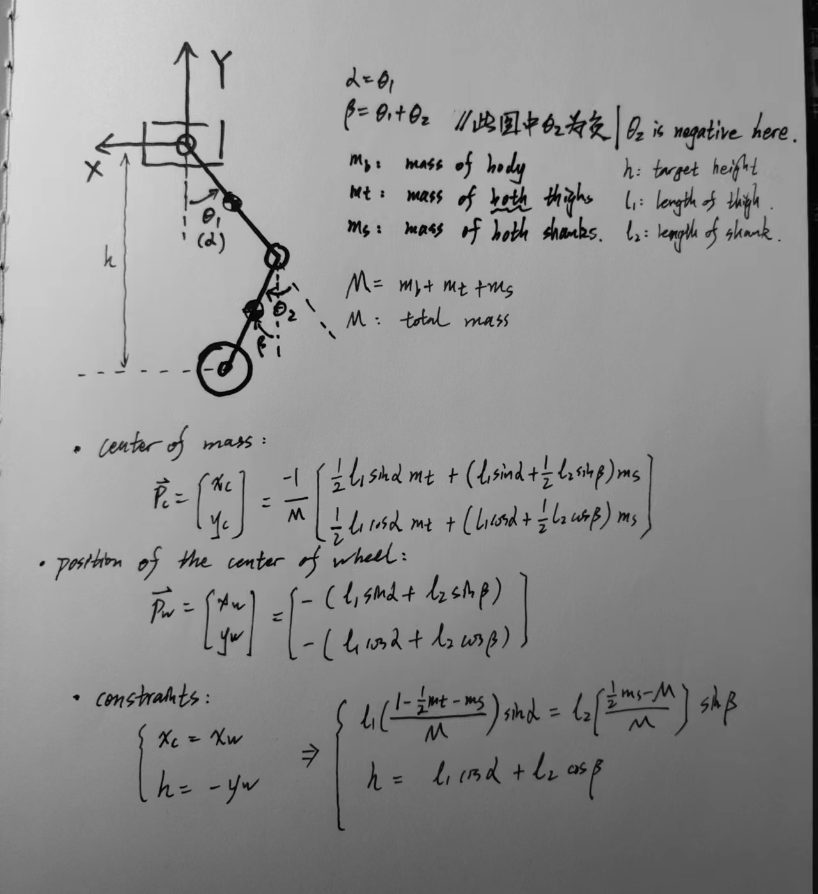

这里放个图给出基本坐标系定义以及运动约束：质心在轮心位置上方，轮子y方向距离等于给定的机器人高度。

根据基本的三角关系：
$$
sin^2\beta + cos^2\beta = 1
$$
带入途中最下方得到的运动学约束：
$$
\frac{A^2}{B^2}sin^2 \alpha + \frac{h^2}{l_2^2} - \frac{2hl_1}{l_2^2}cos\alpha + \frac{l_1^2}{l_2^2}cos^2 \alpha = 1
$$
其中
$$
A = l_1 (\frac{M - 0.5m_t -m_s}{M}) \ \ \ B=l_2(\frac{0.5m_s - M } { M})
$$
最后会得到一个关于cos(\alpha)的一元二次方程，规定a是个小于pi/2的正值。取求根公式的正项。

然后反三角函数求a，sina，sinb，b，就得到了需要的关节内容。

下面是关于这个逆运动学求解过程的函数：传入参数是期望机器人高度h，别的机器人参数已经在初始化的时候给定，这里看不到赋值。

```cpp
void Robot_Class::InverseKinematicsSolving(double target_h)
{
    //进行高度的上下界判断
    double h;
    h = target_h>0.55?0.55:target_h;
    h = h<0.1?0.1:h;

    //进行是否进行了初始化的判断
    if(robot_init_flag!=1)
        return; //没有初始化完毕，不允许求解逆运动学。
    
    //下述内容对逆运动学进行计算
    double A,B;
    A = l1 * (mass_total - 0.5*mass_both_thigh - mass_both_shank) / mass_total;
    B = l2 * (0.5 * mass_both_shank - mass_total) / mass_total;
    ROS_INFO("Solve A: %.3f B: %.3f \n",A,B);
    double a,b,c; //一元二次函数的参数;
    a = (l1*l1)/(l2*l2) - A*A/(B*B);
    b = - 2*target_h*l1/ (l2*l2);
    c = target_h*target_h/(l2*l2) + A*A/(B*B) - 1;

    ROS_INFO("Solve a: %.3f b: %.3f c: %.3f\n",a,b,c);
    double cosa,cosb;
    
    cosa = (-b + sqrt(b*b - 4*a*c))/2*a; //只选择正解，要求theta1 在pi/2以下。

   
    //求解结果转换为关节参数进行下达
    Target_Pos_Hip = (float)acos(cosa);
    double beta = asin( A * sin(Target_Pos_Hip) / B );
    Target_Pos_Knee = beta - Target_Pos_Hip;

    ROS_INFO("Solve cosa: %.3f  theta1: %.3f theta2: %.3f\n",cosa,Target_Pos_Hip,Target_Pos_Knee);
    
}
```

### 5.2 动态变化高度的代码实现

这部分的代码，目的在于防止机器人高度突变，使得机器人失稳。
解决思路是规定机器人的高度在每一个变化周期（以一个比while循环小的频率）内，变动一个小的增量。

实现方式：

在while循环当中进行计数，通过这种方式降低频率。
判断当前高度与期望高度之间的大小关系，然后以小增量靠近目标期望高度。
求解一次逆运动学。

下面是int main当中相关的部分。

```cpp
 	    ros::Subscriber HeightCmdSub = nt.subscribe<std_msgs::Float64>("wbr_height_cmd",10,doMsg_height);
   //  ... //
 	
 	int height_change_rate = 10; //  100/10 = 10hz
    int height_change_counter = 0;
    double height_change_delta = 0.01;
    double height_changing_target;
    
    //  ... //
    
    
    //while启动之前的初始化工作
    height_changing_target = 0.5; //默认启动的位置。
    Myrobot.target_h = 0.5;


    // 主循环
    while (ros::ok())
    {
        // ROS_INFO("talker is working");
    
        control_rate_counter++;
        height_change_counter++;
        // ROS_INFO("talker is on111");
        //逆运动学求解部分，按照频率变化[此举将使机器人关节能够缓慢地变动]
        if(height_change_counter >= height_change_rate)
        {
            //计算距离给定目标位置的差距
            if(Myrobot.target_h - height_changing_target > height_change_delta)
                height_changing_target += height_change_delta;
            else if(Myrobot.target_h - height_changing_target < -height_change_delta)
                height_changing_target -= height_change_delta;

            //计算逆运动学
            Myrobot.InverseKinematicsSolving(height_changing_target);
            ROS_INFO("recivedH: %.2f targetH: %.2f theta1: %.2f theta2: %.2f",Myrobot.target_h,height_changing_target, Myrobot.Target_Pos_Hip, Myrobot.Target_Pos_Knee);
            // 发布目标角度位置
            HipPosMsg.data = Myrobot.Target_Pos_Hip;
            KneePosMsg.data = Myrobot.Target_Pos_Knee;

            LeftHipCmdPub.publish(HipPosMsg);
            LeftKneeCmdPub.publish(KneePosMsg);
            RightHipCmdPub.publish(HipPosMsg);
            RightKneeCmdPub.publish(KneePosMsg);

            //清空计时器
            height_change_counter = 0;
        }
        
        // ... //
        
       
    }//结束循环
    
    // ... ///
    
```

当然，目标高度需要通过一个回调函数进行调整，回调函数的定义如下：

```cpp
void doMsg_height(const  std_msgs::Float64::ConstPtr & msg_p){  // 传感器的回调函数
    double h = msg_p->data;
    h = h>0.55?0.55:h;
    h = h<0.1?0.1:h;

    Myrobot.target_h = h;
}
```

## 6、IMU传感器加入

为了实现机器人的平衡控制，需要在gazebo仿真中加入IMU模块的消息。

 


经过简单的代码编写，IMu模块已经进入了模型之中。但是十分有意思的一点在于，机器人模型从高空落下的时候，碰到地面会有非常剧烈的反应（震开）

我不知道这是为什么，我怀疑是虚拟机的性能不够导致的。我将切换到双系统，看看这个问题是不是还在。

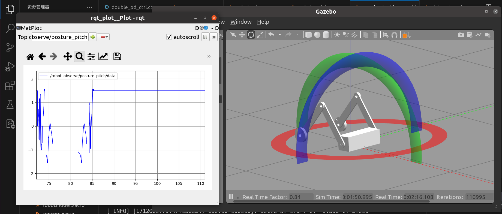
