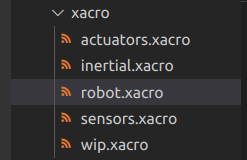
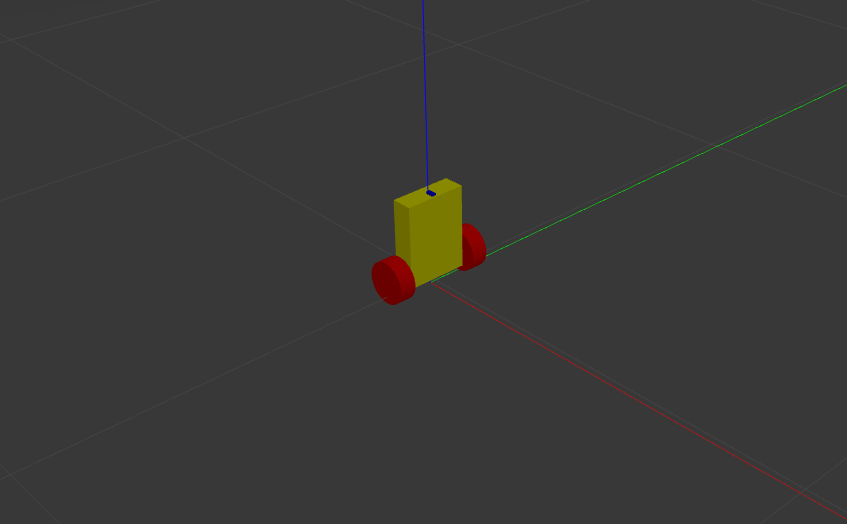
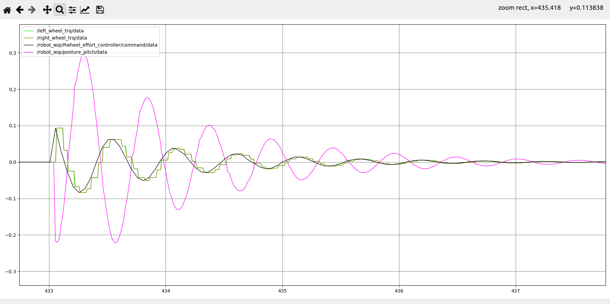
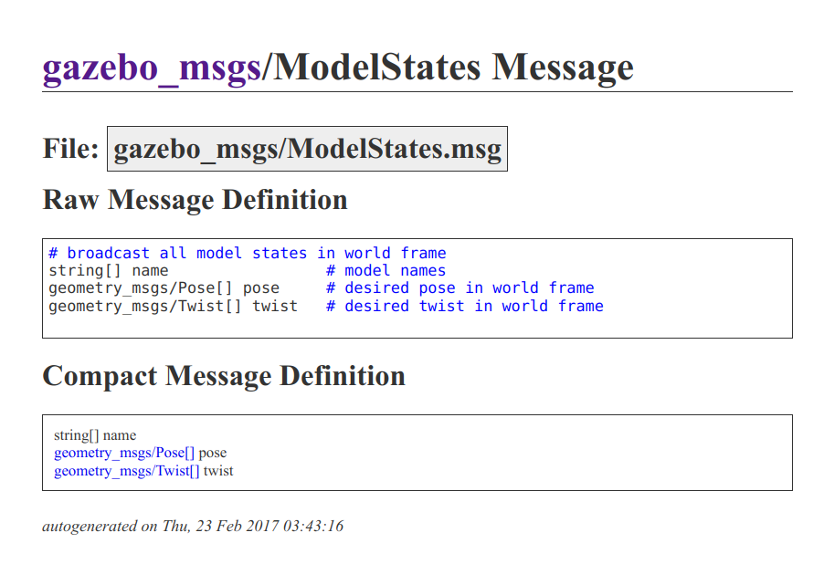
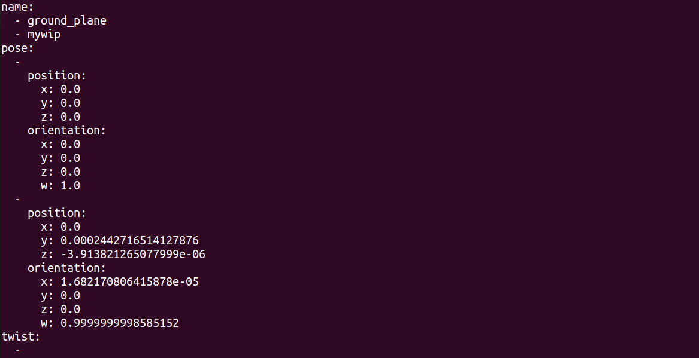
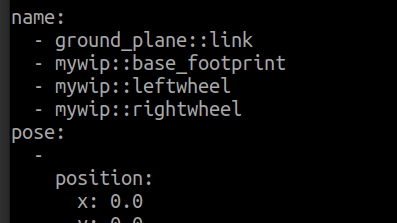

# Basicwip_ws工程文件

---

主要记录基本的在Gazebo当中构建轮式倒立摆的过程。重要的参考内容。

本工程将会包括关于：

【仿真环境的基本配置： xacro + gazebo】

【仿真环境下的驱动器配置】

【仿真环境下的传感器配置】

【仿真环境中动态调试的基本配置】【还没实现】
	【yaml cfg】


## 工程基本概况

本工程记录最简单的轮式倒立摆（wheeled Inverted Pendulum，WIP）的gazebo仿真实现流程。可以作为上手Gazebo机器人仿真的一种参考资料。

## 一、仿真环境基本配置

系统：Ubuntu20.04 + ros-noetic + gazebo11（classical，后来改了版本了）

首先是编写基本的机器人的urdf（或者xacro）文件：



（上图为本工程涉及到的机器人内容，inertial为计算惯量的文件，wip为机器人模型描述，actuators为执行器，用于绑定驱动器；sensors为传感器，用于绑定传感器）

第二步是在launch文件中进行基本的gazebo启动：

```xml
<launch>
    <!-- <arg name="paused" default="true" /> -->
    <!-- 将 Urdf 文件的内容加载到参数服务器 -->
    <param name="robot_description" command="$(find xacro)/xacro $(find basic_wip)/xacro/robot.xacro" />
    <!-- 启动 gazebo -->
    <include file="$(find gazebo_ros)/launch/empty_world.launch" />
    <!-- 在 gazebo 中显示机器人模型 -->
    <node pkg="gazebo_ros" type="spawn_model" name="model" args="-urdf -model mywip -param robot_description"  />

</launch>
```

没有bug就会在gazebo当中启动模型（不过没有控制器，很快会倒下）



## 二、驱动器基本配置

本部分主要研究如何在gazebo中导入机器人模型的基础上，给机器人的关节添加驱动器，从而可以控制机器人的关节运动。

### 2.1 transmission

[对urdf中transmission的官方说明](http://wiki.ros.org/urdf/XML/Transmission)。

transmission标签用于描述**驱动器**与**关节**的关系【教程已经讲得很清楚了，这里就不记录了】

【需要额外说明的是：Hardware Interfaces 似乎有非常多的选择，目前可能用不到太多，不过可以日后加以注意】


### 2.2 gazebo_ros_control

```xml
    <gazebo>
        <plugin name="gazebo_ros_control" filename="libgazebo_ros_control.so">
            <robotNamespace>/robot_wip</robotNamespace>
        </plugin>
    </gazebo>
```

指明一个控制空间，似乎是这样的,我将这个/robot_wip 与 robot.xacro 中的name属性保持一直，统称/robot_wip


### 2.3 yaml 文件

和GNU操作系统命名有点像， 递归命名， GNU's Not Unix。

YAML似乎是： YAML  Ain't a Markup Language ： YAML不是一个标记语言。（不过一说 Yet Another Markup Language）。当个小乐子看看就好。

定义robot_wip.yaml文件：

```yaml
robot_wip:
  # Publish all joint states -----------------------------------
  joint_state_controller:
    type: joint_state_controller/JointStateController
    publish_rate: 50  

  # Position Controllers ---------------------------------------
  Lwheel_effort_controller:
    type: effort_controllers/JointEffortController
    joint: leftw2base
    pid: {p: 100.0, i: 0.01, d: 10.0}
  Rwheel_effort_controller:
    type: effort_controllers/JointEffortController
    joint: rightw2base
    pid: {p: 100.0, i: 0.01, d: 10.0}
```

主要是下面的两个控制器，会将基本的关节力矩控制器绑定到对应的关节上。


### 2.4 launch 文件

```xml
<!-- 以下部分是新加入的关于控制相关的内容 -->
    <!-- 1 Load joint controller configurations from YAML file to parameter server -->
    <rosparam file="$(find basic_wip)/yaml/robot2.yaml" command="load"/>
    <!-- 2 load the controllers -->
    <node name="controller_spawner" pkg="controller_manager" type="spawner" respawn="false"
        output="screen" ns="/robot_wip" args="
        joint_state_controller 
        Lwheel_effort_controller
        Rwheel_effort_controller"
        />


    <!-- 启动自己写的控制节点 -->
    <node pkg="basic_wip" type="wip_ctrl_node" name="wip_controller"  output="screen" respawn ="true">
        <!-- <rosparam file="$(find basic_wip)/cfg/defaultpidpara.yaml" command="load"/> -->
    </node> 

```

打开yaml文件，启动对应的控制器，下面的node是本文第四章所用的控制器。


## 三、传感器基本配置

本部分主要研究如何在gazebo中导入机器人模型的基础上，如何绑定特定的传感器，以及读取和处理传感器消息。

绑定IMU模块

```xml
  <!-- IMU plugin for 'imu_link' ， 实际上，由于imu与body是固连的，所以直接绑定body（此工程中base_link）也ok-->
  <gazebo reference="imu_link">
    <gravity>true</gravity>
    <sensor name="imu_sensor" type="imu">
      <always_on>true</always_on>
      <update_rate>100</update_rate>
      <visualize>true</visualize>
      <topic>__default_topic__</topic>
      <plugin filename="libgazebo_ros_imu_sensor.so" name="imu_plugin">
        <topicName>imu</topicName>
        <bodyName>imu_link</bodyName>
        <!-- 此处也有一个bodyName -->
        <updateRateHZ>100.0</updateRateHZ>
        <gaussianNoise>0.0</gaussianNoise>
        <xyzOffset>0 0 0</xyzOffset>
        <rpyOffset>0 0 0</rpyOffset>
        <frameName>imu_link</frameName>
        <!-- 这个frameName是否可以使用imu_link 需要经过测试，因为原本这个代码的参考bodyName并非imu_link，这是我起的link名字 -->
      </plugin>
      <pose>0 0 0 0 0 0</pose>
    </sensor>
  </gazebo>

```

绑定到imu_link上。


## 四、控制器编写

控制器需要完成的工作内容主要有三个部分：

- 读取IMU模块的消息
- 使用PD控制器解算轮子力矩
- 将计算后的轮子力矩发送到对应的TOPIC上，完成控制

主要的代码部分如下：

### 4.1 Robot_Class , 定义一个机器人类

### 4.2 定义IMU的回调函数

### 4.3 主循环的收发逻辑

（时间关系这些地方没有把代码粘贴过来，可以直接去看code）

## 五、【TODO】额外配置

### 5.1 【TODO】动态调参插件

### 


## 六、Debug

### 思路有问题的一次

```cpp
        if(control_rate_counter >= control_rate_scaler)
        {
            Myrobot.BalancePidControl();
            //Myrobot.SetRobotBalanceCmd(-Myrobot.balance_calculated_effort,-Myrobot.balance_calculated_effort);
            BalanceCmdMsg.data = -static_cast<double>(Myrobot.balance_calculated_effort);
            
            //发送控制指令。
            LeftWheelEffortCmdPub.publish(BalanceCmdMsg);
            RightWheelEffortCmdPub.publish(BalanceCmdMsg);


            // pubcmd.publish(tcmd);
            control_rate_counter = 0;
        }   
        // IMU消息解算
        RobotPitch.data = -static_cast<double>(Myrobot.orientation_pitch);
        RobotPitchAngle.publish(RobotPitch);// 用于监视的话题。

        Left_Trq_Msg.data = static_cast<double>(Myrobot.LeftJoint_Trq);
        Right_Trq_Msg.data = static_cast<double>(Myrobot.RightJoint_Trq);
        
        LeftWheelTrqPub.publish(Left_Trq_Msg);
        RightWheelTrqPub.publish(Right_Trq_Msg);
        
```


这是一个平衡车While循环打当中的一段话。if语句当中已经进行了力矩的控制。当时的错误是将最后一句发布力矩（这个是为了做观测，之后力控大约能用上）消息，写错成了if当中的RightWheelEffortCmdPub。现象就是gazebo启动之后，机器人原地疯转。但我是从前往后将添加的所有和JointStates都注释掉之后，一点点添加后找到的。为什么不直接根据现象去查阅发送的消息呢？你看到的现象是原地旋转，说明有一个轮子收到的力矩指令是“乱动”，你就应该去看看是不是pub 了不该pub的消息。而不是使用这种“删改法”


让我想起了上学期（2023秋）和学弟一起调Dummy的一件事情，当时控制的kp kd参数给反了。表现的现象是当角度快速变化的时候，末端轮子连续转动；而机器人处在平衡位置的时候，或者不动的时候，轮子会抽搐。为什么不从“连续变化的时候，机器人的轮子能够平稳运动”入手，思考出kp、kd给反了的答案呢？

## 莫名其妙的零阶保持器

图中绿色的部分是通过读取/robot_wip/joint_states 消息，然后重新单独publish的（/left_wheel_trq/data），这样做是因为，完整的/robot_wip/joint_states 消息是一个类似及结构体的内容rqt_plot画不出来，需要吧自己感兴趣的消息读取之后再发送出来。




## 末、相关知识内容记录

### L.1 gazebo_msgs

#### /gazebo/model_states



在gazebo当中，modelstates包含三个数组，名为name的字符串数组；名为pose 的 属于标准ros geometry_msgs/Pose 类型的数组；以及twist数组。

在导入机器人模型的时候，名为mywip的整体会作为gazebo仿真环境发布model_states的一个对象。

```xml
    <node pkg="gazebo_ros" type="spawn_model" name="model" args="-urdf -model mywip -param robot_description"  />

```

使用 rostopic echo /gazebo/model_states 可以查看：



name数组表示：当前的models有两个，第一个是平面（空世界自带的），第二个是我们导入的wip模型；
pose数组对应的显示了两组pos和orientation，表示了平面和机器人的位姿。
twist不展示了，同理是两组linear和angular。

#### /gazebo/link_states

这个topic会显示所有的link。这样就包含了wip模型下辖的links。不过似乎只包含了存在相对运动的links，对于固连的link，似乎会选择忽略：




#### /clock

类型： rosgraph_msgs/Clock

根据ros.org [官网上的介绍](http://wiki.ros.org/rosgraph_msgs),从属于rosgraph_msgs的topics都属于底层的topic，是不希望用户去动的。

在gazebo环境当中：

Reset world，将会导致/clock topic重置，重新从0开始计时；

Reset model pose，则不会导致/clock topic变化。

！！！【TODO：之前做仿真的时候，每次使用reset world会导致控制器失效，这次看看能不能研究明白怎么回事】


### L.2 urdf可以用的标签

这里有一个ros.org 当中[描述urdf中有可以有那些标签的网页](http://wiki.ros.org/urdf/XML)


### L.3 Ros_control

此部分用于整理关于ros_control的相关知识【之前这部分就没有完整的处理过】

参考文章：

- [ros.org当中对ros_control的介绍](https://wiki.ros.org/ros_control)，对于ros_control的描述是：包含了controller interfaces \ controller managers \ transmissions \ hardware_interfaces 的一系列包。这里也有不少link可以指向更多的相关资料。
- [知乎文章：ros_control 基础知识](https://zhuanlan.zhihu.com/p/431279381)


#### ros_control 官网说明笔记

​	ros_control 是对 pr2_mechanism 包的重写，目的是将其推广到除了PR2以外的更多的机器人控制上。
