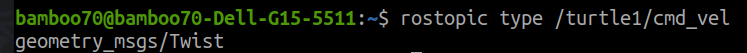
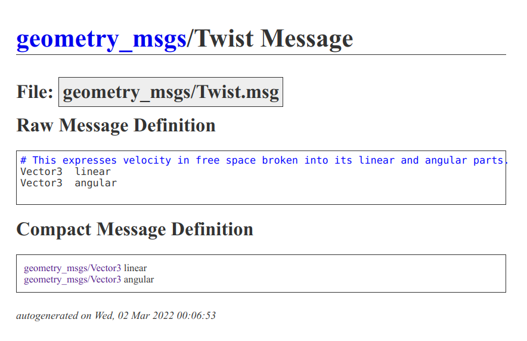

# ComTopic

---

用于复习Topic 对话的实现。

【20240228 首次完成】


## 工程文件简述

功能包：

### - topiccompkg 

定义两个nodes:

talker_node   : talker.cpp

listener_node : listener.cpp

并定义launch文件 topic.launch 同步启动两个节点。

### - turtlemotionpkg

定义一个node：

tcmd_node : tcmd.cpp

定义一个launch:

启动tcmd_node 节点；启动turtlesim中的乌龟节点。

//直接使用小乌龟节点，试一试看看能不能通过“查询消息类型”的方式，自主实现对于乌龟的控制。

---

## AT1：topic存在

​	只要有节点发布，或者有节点订阅某一个特定的topic，此topic在ros中就存在。


## AT2： 发布者节点（cpp）

​	简要记述一个发布者节点需要什么。（cpp版本）

​	初始化并定义句柄，句柄这里就比较重要了，除了能够被控制台查阅到node，也是因为publish需要与这个句柄绑定才可以。

```cpp
    ros::init(argc,argv,"talker"); // ZZW如果使用launch文件启动node，node名称会被覆写，这一点要注意。
    ros::NodeHandle nh;//该类封装了 ROS 中的一些常用功能
    //ZZW：句柄是需要定义的，不然使用rostopic list 在控制台中可能无法看到“talker”这个node。
    ros::Publisher pub = nh.advertise<std_msgs::String>("chatter",10);
```

### AT 关于字符串与发布的字符串

​	在ROS当中，通讯所使用的消息属于一个类。而C语言中的字符串就只是字符串类型。所以进行字符串操作的时候，会存在一些需要注意的细节：

```c++
    std_msgs::String msg; //ZZW: "::"运算符表示所属关系，对于OO编程而言，相当于说定义一个String类型变量
    std::string msg_front = "Hello 你好！"; //消息前缀

// ... 在下面的while循环当中 ... //
    std::stringstream ss;	//另一个类型stringstream 可以用<< 符号拼接字符串
    ss << msg_front << count;
    msg.data = ss.str();	//std_msgs::String所定义的msg不是一个string，而是一个结构体，data为string类型
	//具体的std_msgs如何使用可以查看ros官方提供的数据类型表格
    //发布消息
    pub.publish(msg);
```


总结来说，在话题的发布节点中，需要做的事情就是定义publisher，然后在需要的时候发送对应数据类型的数据到对应的topic当中就可以了。

## AT3： 订阅者节点（cpp）

与发布者相比，订阅者还需要写一个回调函数。以下是订阅者需要的代码：

1、 基本的消息订阅实现：定义节点、句柄、订阅者对象。

在订阅者对象的实现过程中，需要绑定一个消息处理回调函数，这个函数在这里叫做doMsg。

```cpp
    ros::init(argc,argv,"listener");
    //3.实例化 ROS 句柄
    ros::NodeHandle nh;

    //4.实例化 订阅者 对象
    ros::Subscriber sub = nh.subscribe<std_msgs::String>("chatter",10,doMsg);
    //5.处理订阅的消息(回调函数)
```

2、写消息处理函数

```cpp
void doMsg(const std_msgs::String::ConstPtr& msg_p){
    ROS_INFO("我听见:%s",msg_p->data.c_str());
    // ROS_INFO("我听见:%s",(*msg_p).data.c_str());
}
```

::ConstPtr 定义一个指针。一种说法是，复制数据可能比较耗时，所以用指针指向接受到的数据。

【不过怎么说这个数据都是被“收到”了的，可能是为了防止重复的复制吧】


​	

## AT3: ros::spin() & ros::spinOnce()

ros::spin()会一直卡着，node会一直看有没有要处理的回调函数。

ros::spinOnce()一般在循环当中使用，node会看一下当前缓冲区当中有几个数据，然后会调用几次回调函数，之后就不管了。

！！！！重点来了：如果spinOnce()调用的回调函数比较耗时，而这个时候又不断地有新的数据进入缓冲区，以至于顶掉了之前的数据，将使得spinOnce()继续处理的时候所处理的消息，不再是spinOnce()当时调用的时候所处理的消息。

【Q：如果，将spinOnce写在while当中，单次的spinOnce()还没有处理完对应的次数，while循环又跑到了spinOnce()这句话，会发生什么呢？】

[ros::spin() 或 ros::spinOnce(),ros消息队列理解](https://blog.csdn.net/weixin_45258318/article/details/121927528)

## EX小乌龟控制

因为是复习，所以不妨直接通过一个无教程实例来完成复习和巩固。

首先启动乌龟，查看有何种topic，并通过rostopic type 查询对应topic 的类型；



然后去官网看看这个数据类型是什么:



然后尝试在代码里实现这个类型的发送，这个实例就完成了。

主要内容：

```cpp
   #include "geometry_msgs/Twist.h" 
   //...
   
   ros::Publisher pub = nh.advertise<geometry_msgs::Twist>("/turtle1/cmd_vel",10);
    
   //...
   
   geometry_msgs::Twist cmd;

    cmd.angular.x = 0;
    cmd.angular.y = 0;
    cmd.angular.z = 1;

    cmd.linear.x = -1;
    cmd.linear.y = 0;
    cmd.linear.z = 0;

//...
        pub.publish(cmd);
    
```

详细代码看工程文件

