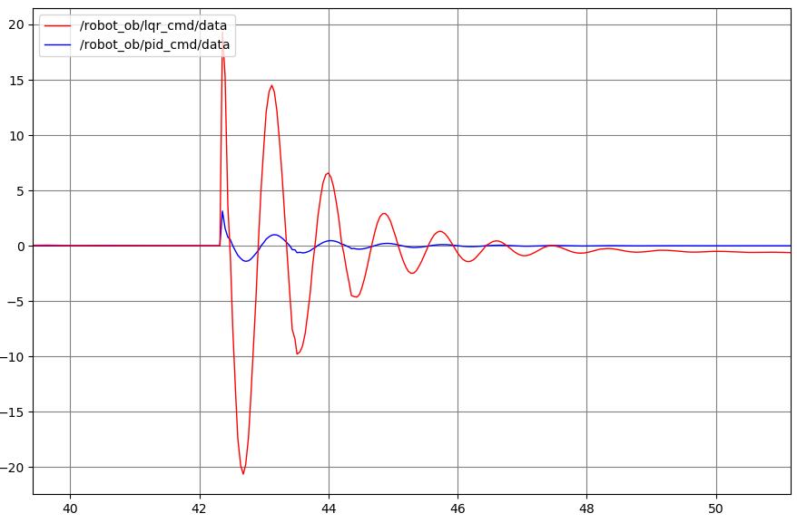
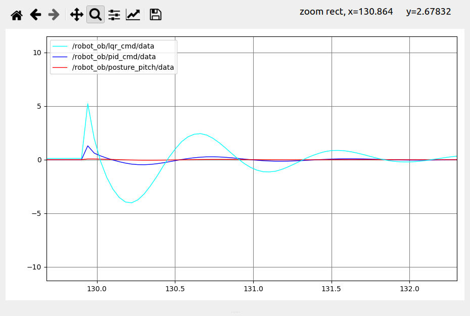

# WBR2_ws 工程文件说明

---

这是一个工程log

## Log(过程)

### 240509

在功能包wbr_pkg 下面的include 目录中创建 wbr_pkg 目录，然后再在此子目录下创建.h文件。

此时，CPP文件中调用这些文件的方式为：

```cpp
#include "wbr_pkg/xxx.h"
```

注意：此引号所对应的，就是功能包下面的inlcude 目录，因为此目录下有一个子目录wbr_pkg，所以引用的时候有这样的一个前缀。

另外，还需要修改功能包的CMakeList.txt文件：

```cpp
## Your package locations should be listed before other locations
include_directories(
  include
  ${catkin_INCLUDE_DIRS}
)
```

将include_directories中的include项目解除注释。


### 240509

计划在构建工程文件目录的时候，学习一下CPP面相对象变成的方式。

感觉可以切换到双系统取处理问题了


### 240510

研究一下如何

#### 获取机器人状态 

机器人状态定义为：$$  [x \ \theta \ \dot x\  \dot \theta]^T \  $$ ,即轮心位置，虚拟杆倾斜角，轮心速度，虚拟杆倾斜角速度。 

**角度**

不论是角度，还是角速度，都可以直接从IMU上获取。实际机器上应该也是这个路子，所以我们直接在解析IMU数据的位置，给状态中的角度、角速度分量进行取值。

**速度**

先使用一种偷懒的方法，因为我着急测试控制方法，就懒得在状态估计上做工作了。但是后期如果想要移植到实际的机器人上，还是需要对轮子位置，以及机器人的运动速度进行状态估计。可以用编码器获取轮子位置，积分得到轮心在坐标系下的位置，并根据一定频率的差分、滤波来计算近似的轮心位置的速度。

本次实验当中我们将直接利用Gazebo仿真环境，获取机器人的轮心位置与速度。

```yaml
/gazebo/link_states
```

上述话题是gazebo发布的，消息类型为：

```
gazebo_msgs::LinkStates
```

在使用的时候需要注意一点，launch文件中加载模型的语句如下：

```xml
    <!-- 在 gazebo 中显示机器人模型 -->
    <node pkg="gazebo_ros" type="spawn_model" name="model" args="
    -urdf 
    -model wbr_robot 
    -param robot_description"/>
```

其中 -model后面的 wbr_robot 似乎有一种"namespace"的意味。

### 实现LQR

我们给机器人以一个初始的角度，响应如图：



看起来LQR的趋势是对的，但是我想起来，控制量u直接等于了K*X，少了个负号，但是加上之后肯定有问题... ... 

如果$$ \tau = -K\vec X $$, 一个直观的现象就是，上面红色部分的曲线会完全反过来，也就是失控。

但是图中除了幅度有点大以外，输出力矩的方向都是合适的... 

看似可以直接缩放，但是这不能解释幅度的问题；

更不能解释“正确的方向”其实在反面的问题


## 240513

重新推导WIP的模型，基于Lagrange方法。关键的地方有两个：

1、 使用轮子的角度来代替原有的位置：$$ x = \phi r $$ , $$  \phi $$ 是轮子从初始位置出发，总的转动角度。

2、在列写的lagrange函数当中
$$
\begin{align}
\left\{
	\begin{aligned}
		\frac{d}{dt}\frac{\partial L}{\partial \dot \phi} - \frac{\partial L}{\partial \phi} = T \\
		\frac{d}{dt}\frac{\partial L}{\partial \dot \theta} - \frac{\partial L }{\partial \theta} = -T \\ 
	\end{aligned}
\right.
\end{align}
$$
对于轮子的转动角度，驱动它的是广义力T；对于小车的倾斜角度，驱动它的是广义力-T。

一般而言，比如一个两自由度机械臂，取关节坐标作为系统的广义坐标，对应的广义力就是关节的驱动力。但是这种方程是建立在机器人有一个固定坐标系的情况下的。对于WIP这种浮动基座的机器人，很有必要说明T同时驱动了两个关节。所以有上述的形式。


### 测试

方向是ok 的，上述模型得到的结果也是比较拟人的，

但是：



输出幅度太大了，感觉上差了什么量纲一样。


尝试了以下的代价函数：

Q = diag([1000 100 10 1]);
R = 1000;

得到的控制效果：

平衡控制非常优异，但是位置控制堪称灾难。


可能还是模型有问题。


我在思考... 会不会是gazebo没有反作用力?【这个假设多少有点离谱了啊】


## Notes(整理)

